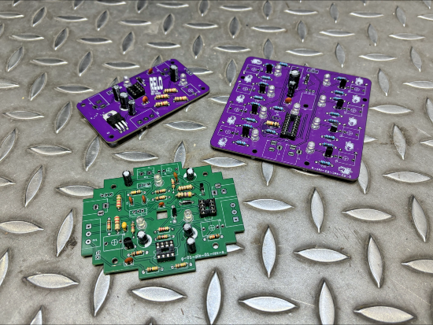
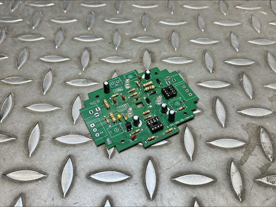

# Grupo 01 - Piezo

Integrantes:

- Benjamín Alonso Álvarez Pavez / [benjaminalvarez21](<https://github.com/disenoUDP/dis8644-2026-1-procesos-2/tree/main/03-benjaminalvarez21>)
- Anays Valentina Cornejo Candia / [Anaysval](<https://github.com/disenoUDP/dis8644-2026-1-procesos-2/tree/main/09-Anaysval>)
- Bruno Ferrari Meyer / [chknngttts](<https://github.com/disenoUDP/dis8644-2026-1-procesos-2/tree/main/11-chknngttts>)
- Lucas Ignacio Ortiz Aguirre / [ryukivol](<https://github.com/disenoUDP/dis8644-2026-1-procesos-2/tree/main/21-ryukivol>)
- Nicolás Elías Valdés Greve / [nicolasvaldesgreve](<https://github.com/disenoUDP/dis8644-2026-1-procesos-2/tree/main/31-nicolasvaldesgreve>)

# Montaje de componentes y soldadura en PCB

Para estar preparados cuando llegase el momento de soldar los componentes a nuestra PCB, decidimos hacer una lista de componentes de Maincra para identificar qué cosas tendríamos que comprar y cuales ya se encontraban en el LID.

# Partituras

### Ideas descartadas de partituras

#### Escaleras

(ver. literal) Como grupo 01 (las 5 personas) nos vamos a República 180, Santiago de Chile con "maincra" (piezo 01), el parlante estándar y un oscilador. Al llegar a la FAAD situamos "maincra" en uno de los hoyos de la muralla que soporta la escalera de cemento expuesto. Conectamos los piezos a escalones en distintos pisos y nos unimos a los estudiantes/profesores/funcionarios que estén subiendo o bajando la escalera. La idea es hacer sonar el oscilador a través de nuestro circuito (y el parlante). Esto duraría 5 minutos. 

#### Golpear

(ver. literal)  Sacar los piezos por la ventana de la sala 202 de Salvador Sanfuentes y hacerlos ingresar por la ventana de la sala 101. Conectarlos a las mesas de esta última sala y comenzar a golpearlas. El sonido del sintetizador se escucha en la sala 202, aunque la activación ocurre en el espacio inferior. 

#### Voz

(ver. literal)  Conectar el piezo a la garganta del intérprete. Este grita durante 30 segundos mientras sale de la sala. Luego, el piezo se desconecta, generando un silencio absoluto de 4 minutos. Posteriormente, el intérprete vuelve a conectar el piezo y entra nuevamente a la sala gritando durante otros 30 segundos. 

### Partituras oficiales

#### Ping Pong

(ver. literal) Como grupo-01 vamos a ir a República 180, Santiago de Chile con “maincra” (piezo-01), el parlante, RELO (Reloj 555 Monoestable) y “nyan cat” (secuenciador-2). Poner un piezo en cada lado superior de la mesa al centro, y pegar a la mesa 	con cinta adhesiva. Jugar una partida con paletas y pelota de Ping Pong que se piden donde los guardias. Con el impacto de la pelota en la mesa el secuenciador avanza, haciendo que el oscilador pueda funcionar. Jugar durante 5 minutos. Al perder, se cambian los jugadores. Al finalizar los 5 minutos se devuelven las paletas y pelota a los guardias. 

(ver. poética)

>Ve a República 180 y ubica el piezo en la mesa de ping pong

>Invita a alguien a jugar

>Jueguen durante 5 minutos o hasta que se aburran

 

 

- Ejemplo del funcionamiento del circuito.
	- Gracias a estos 2 estudiantes de arquitectura que amablemente jugaron Ping Pong para ver si el piezo detectaba las vibraciones de la pelota golpeando la mesa.

#### Torniquetes

Como grupo-01 dirigirse a los torniquetes de República 180 y poner un piezo en cada extremo del set que se encuentran en la entrada de la facultad. Procurar que los cables estén asegurados al piso con cinta gaffer para evitar accidentes. Entrar y salir de la FAAD junto a los estudiantes, funcionarios y profesores haciendo funcionar el piezo, secuenciador, RELO y parlante. Tanto la verificación del scan QR como la rotación del torniquete en sí funcionan como activadores del piezo.

(ver. poética)

>Ve a República 180

>Ubica el piezo en los torniquetes

>Mira cómo la gente entra y sale

>Código, giro, sonido

 

- Ejemplo del funcionamiento del circuito.
	- El piezo logra detectar el momento en el que el QR se verifica.

--- 

### PCB

 

--- 

# BOM PCB UTILIZADAS

### BOM PCB MAINCRA

| Componente | Cantidad | PCB | Valor unitario | Link | ¿Hay stock en LID? |
| --- | --- | --- | --- | --- | --- |
| Chip NE555P | 1 | U1 | $490 | <https://www.victronics.cl/circuitos-integrados/lm555cngeneralpurposebipolartimerdip8/> | Si |
| Chip TL072CP | 1 | U4 | $990 | <https://www.victronics.cl/circuitos-integrados/tl072cpdualjfetlowpoweropamplifierdip8/> | No |
| Regulador L7805CV | 1 | U3 | $350 | <https://www.victronics.cl/reguladores/reguladorvoltl7805cv5v-15ato220/> | No |
| Diodo 1N4007 | 1 | D5 | $200 | <https://www.mechatronicstore.cl/diodo-rectificador-in4007-1n4007-4007/> | Si |
| Diodo 1N5819 | 2 | D6, D7 | $586 | <https://cl.rsdelivers.com/product/nexperia/bat85113/nexperia-diodo-bat85113-diodo-schottky-200-ma-30-v/0300978> | No |
| Transistor 2N2222 | 1 | Q1 | $200 | <https://www.mechatronicstore.cl/transistor-2n2222/> | Si |
| Potenciómetro B10K | 1 | RV1 | $495 | <https://altronics.cl/potenciometro-lineal-10k-b10k> | X |
| Potenciómetro B500K | 1 | RV2 | $495 | <https://altronics.cl/potenciometro-lineal-500k-b500k?search=b500k> | Si |
| LED 3mm | 3 | D1, D2, D8 | $100 | <https://www.mechatronicstore.cl/led-3mm-5mm/> | Si |
| Resistencia 47 Ω | 1 | R12 | $90 | <https://www.electroardu.cl/resistencias-1k-ohm?srsltid=AfmBOor81HKrzfoOTnLK3FU6ObPuf1EPUVMS0naCwqMNIzGt8LYDiUYt> | No |
| Resistencia 100 Ω | 1 | R18 |  $90 | <https://www.electroardu.cl/resistencias-1k-ohm?srsltid=AfmBOor81HKrzfoOTnLK3FU6ObPuf1EPUVMS0naCwqMNIzGt8LYDiUYt> | Si |
| Resistencia 220 Ω | 1 | R14 | $90 | <https://www.electroardu.cl/resistencias-1k-ohm?srsltid=AfmBOor81HKrzfoOTnLK3FU6ObPuf1EPUVMS0naCwqMNIzGt8LYDiUYt> | Si |
| Resistencia 1 KΩ | 6 | R1, R3, R6, R7, R8, R11 | $90 | <https://www.electroardu.cl/resistencias-1k-ohm?srsltid=AfmBOor81HKrzfoOTnLK3FU6ObPuf1EPUVMS0naCwqMNIzGt8LYDiUYt> | Si |
| Resistencia 2,2 KΩ | 1 | R13 | $90 | <https://www.electroardu.cl/resistencias-1k-ohm?srsltid=AfmBOor81HKrzfoOTnLK3FU6ObPuf1EPUVMS0naCwqMNIzGt8LYDiUYt> | No |
| Resistencia 10 KΩ | 2 | R4, R5 | $90 | <https://www.electroardu.cl/resistencias-1k-ohm?srsltid=AfmBOor81HKrzfoOTnLK3FU6ObPuf1EPUVMS0naCwqMNIzGt8LYDiUYt> | Si |
| Resistencia 100 KΩ | 3 | R2, R16, R17 | $90 | <https://www.electroardu.cl/resistencias-1k-ohm?srsltid=AfmBOor81HKrzfoOTnLK3FU6ObPuf1EPUVMS0naCwqMNIzGt8LYDiUYt> | Si |
| Resistencia 2,2 MΩ | 1 | R15 | $90 | <https://www.electroardu.cl/resistencias-1k-ohm?srsltid=AfmBOor81HKrzfoOTnLK3FU6ObPuf1EPUVMS0naCwqMNIzGt8LYDiUYt> | No |
| Condensador cerámico 1 µF | 1 | C9 | $100 | <https://www.mechatronicstore.cl/condensadores-ceramicos-distintos-valores/> | No |
| Condensador cerámico 4.7 nF | 1 | C12 | $100 | <https://www.mechatronicstore.cl/condensadores-ceramicos-distintos-valores/> | No |
| Condensador cerámico 10 nF | 1 | C13 | $100 | <https://www.mechatronicstore.cl/condensadores-ceramicos-distintos-valores/> | No |
| Condensador cerámico 100 nF | 3 | C1, C7, C10 | $100 | <https://www.mechatronicstore.cl/condensadores-ceramicos-distintos-valores/> | Si |
| Condensador polarizado 10 µF | 2 | C9, C11 | $100 | <https://www.mechatronicstore.cl/condensador-capacitorio-de-electrolitico-por-unidad-varios-valores/> | Si |
| Condensador polarizado 100 µF | 3 | C2, C3, C5 | $100 | <https://www.mechatronicstore.cl/condensador-capacitorio-de-electrolitico-por-unidad-varios-valores/> | Si |
| Piezo | 1 | J8 | $990 | <https://www.mechatronicstore.cl/sensor-piezoelectrico-27mm-con-cable/> | Si |
| Cables dupont 40 uni. | 1 | - | $2.990 | <https://mcielectronics.cl/shop/product/cable-dupont-macho-macho-20cm-pack-40-unidades-2/> | Si |
| Batería 9V recargable | 1 | BT1 | $7.990 | <https://www.sodimac.cl/sodimac-cl/articulo/110251085/bateria-recargable-9v/110251089> | Si |
| Interruptor Switch | 1 | SW3 | $570 | <https://www.katode.cl/switches/1339-interruptor-switch-2-pines-on-off-corto.html?srsltid=AfmBOorJlIeUySzAORFwXSattHKE4BKH2LmhhXZS_8fZ4MW-G6kwnxqA> | No |

### BOM PCB 02, GRUPO 02: REGISTRO DE DESPLAZAMIENTO ESTÁTICO / NYAN CAT

| Componente | Cantidad | PCB | Valor unitario | Link | ¿Hay stock en LID? |
| --- | --- | --- | --- | --- | --- |
| Chip 4015 | 1 | U2 | $1.400 | <https://www.mactronica.com.co/cd4015?srsltid=AfmBOopMDQhFv0vy6tj-sATCKe9rcEpOGbsfz7VMFRrBPl9Yq3KS80wU> | No |
| Regulador L7805CV | 1 | U4 | $350 | <https://www.victronics.cl/reguladores/reguladorvoltl7805cv5v-15ato220/> | No |
| Transistor 2N2222 | 8 | Q3, Q4, Q5, Q6, Q7, Q8, Q9, Q10 | $220 | <https://www.cabezacuadrada.cl/product/pn2222a/> | Si |
| Transistor BC548 | 1 | Q1 | $200 | <https://www.mechatronicstore.cl/transistor-bc548/?srsltid=AfmBOorIdGTZFY0mLCpBPP8JWl9WGDELQa-iZIZ95pKPjncWCgmXklr3> | No |
| LED 3mm | 9 | D1, D2, D3, D4, D5, D6, D7, D8, D12 | $100 | <https://www.mechatronicstore.cl/led-3mm-5mm/> | Si |
| Resistencia 220 Ω | 8| R4, R5, R6, R7, R8, R9, R10, R11 | $90 | <https://www.electroardu.cl/resistencias-1k-ohm?srsltid=AfmBOor81HKrzfoOTnLK3FU6ObPuf1EPUVMS0naCwqMNIzGt8LYDiUYt> | Si |
| Resistencia 1 KΩ | 18 | R3, R12, R15, R16, R17, R18, R19, R20, R21, R22, R23, R24, R25, R26, R27, R28, R29, R30 | $90 | <https://www.electroardu.cl/resistencias-1k-ohm?srsltid=AfmBOor81HKrzfoOTnLK3FU6ObPuf1EPUVMS0naCwqMNIzGt8LYDiUYt> | Si |
| Resistencia 10 KΩ | 1 | R2 | $90 | <https://www.electroardu.cl/resistencias-1k-ohm?srsltid=AfmBOor81HKrzfoOTnLK3FU6ObPuf1EPUVMS0naCwqMNIzGt8LYDiUYt> | Si |
| Resistencia 100 KΩ | 1 | R13 | $90 | <https://www.electroardu.cl/resistencias-1k-ohm?srsltid=AfmBOor81HKrzfoOTnLK3FU6ObPuf1EPUVMS0naCwqMNIzGt8LYDiUYt> | Si |
| Diodo 1N4007 | 1 | D11 | $200 | <https://www.mechatronicstore.cl/diodo-rectificador-in4007-1n4007-4007/> | Si |
| Condensador cerámico 100 nF | 1 | C9 | $100 | <https://www.mechatronicstore.cl/condensadores-ceramicos-distintos-valores/> | Si |
| Condensador polarizado 10 µF | 1 | C8 | $100 | <https://www.mechatronicstore.cl/condensador-capacitorio-de-electrolitico-por-unidad-varios-valores/> | Si |
| Condensador polarizado 100 µF | 1 | C7 | $100 | <https://www.mechatronicstore.cl/condensador-capacitorio-de-electrolitico-por-unidad-varios-valores/> | Si |
| Interruptor Switch | 1 | SW4 | $570 | <https://www.katode.cl/switches/1339-interruptor-switch-2-pines-on-off-corto.html?srsltid=AfmBOorJlIeUySzAORFwXSattHKE4BKH2LmhhXZS_8fZ4MW-G6kwnxqA> | No |

### BOM RELO

| Componente | Cantidad | PCB | Valor unitario | Link | ¿Hay stock en LID? |
| --- | --- | --- | --- | --- | --- | 
| Chip NE555P | 1 | U1 | $490 | <https://www.victronics.cl/circuitos-integrados/lm555cngeneralpurposebipolartimerdip8/> | Si |
| Regulador L7805CV | 1 | U2 | $350 | <https://www.victronics.cl/reguladores/reguladorvoltl7805cv5v-15ato220/> | No |
| Diodo 1N4007 | 1 | D1 | $200 | <https://www.mechatronicstore.cl/diodo-rectificador-in4007-1n4007-4007/> | Si |
| Potenciómetro B500K | 1 | RV1 | $495 | <https://altronics.cl/potenciometro-lineal-100k-b100k> | Si |
| Resistencia 1 KΩ | 4 | R1, R2, R3, R4 | $90 | <https://www.electroardu.cl/resistencias-1k-ohm?srsltid=AfmBOor81HKrzfoOTnLK3FU6ObPuf1EPUVMS0naCwqMNIzGt8LYDiUYt> | Si |
| Condensador cerámico 100 nF | 2 | C3, C6 | $100 | <https://www.mechatronicstore.cl/condensadores-ceramicos-distintos-valores/> | Si |
| Condensador polarizado 47 µF | 1 | C1 | $100 | <https://www.mechatronicstore.cl/condensador-capacitorio-de-electrolitico-por-unidad-varios-valores/> | Si |
| Condensador polarizado 220 µF | 1 | C5 | $100 | <https://www.mechatronicstore.cl/condensador-capacitorio-de-electrolitico-por-unidad-varios-valores/> | Si |
| Condensador polarizado 10 µF | 1 | C4 | $100 | <https://www.mechatronicstore.cl/condensador-capacitorio-de-electrolitico-por-unidad-varios-valores/> | Si |
| Condensador polarizado 100 µF | 1 | C2 | $100 | <https://www.mechatronicstore.cl/condensador-capacitorio-de-electrolitico-por-unidad-varios-valores/> | Si |
| LED 3mm | 2 | D2, D3 | $100 | <https://www.mechatronicstore.cl/led-3mm-5mm/> | Si |
