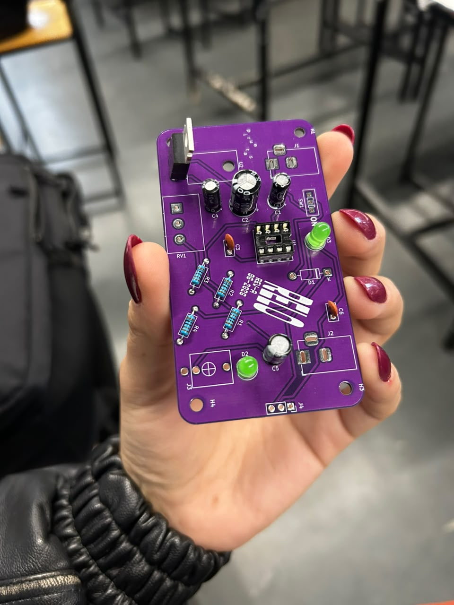
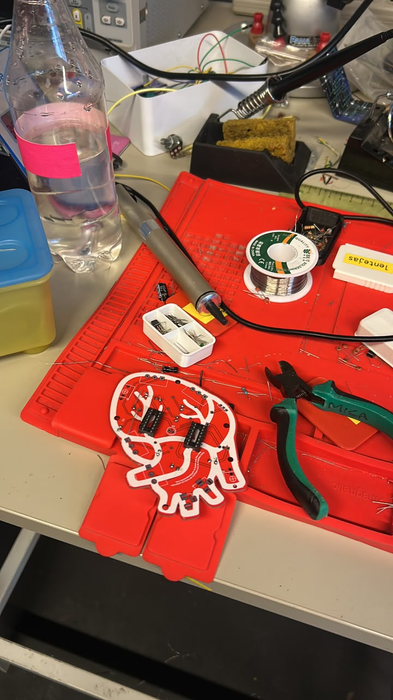
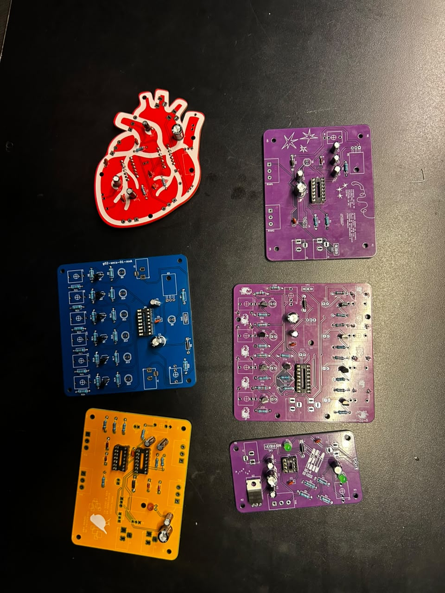

# sesion-14a

Clase 16 de junio

hoy sera clase de soldadura, elegir circuitos 

## **PROCESO**

Esta clase nos dedicamos a soldar
Fue un proceso complicado pero divertido soldar, me queme los dedos pero todo bien, había escases de componentes asi que tuvimos que ir recogien capacitores, resistencias que veiamos por el suelo

