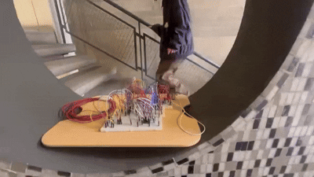

# sesion-13a

Cómo exportar, con el botón trazar, no tocar nada, comprobar el relleno de zona, hacer doble click y apretar el botón que se llama generar archivo de taladrado. Genera archivos drl de drill.

Kicad ofrece el visor gerbert que sirve para visualizar y revisar si está todo bien en la placa, se puede ver cada capa de la placa.

Después de comprobar que todo esté bien, hay que comprimir en un archivo zip.

JLCPCB, se arrastra y se comienza a cotizar, nos dirá cuánto vale. También tiene un gerbert view, se puede ver en 2d, 3d y por capas separadas. Sale 2 dolares, pero el envío sale como 40 dolares. Todo en total salió 382 dólares. Cada uno pagará 8 lucas yajuuuuuuu (gracias profes).

Las placas tienen la entrada a la izquierda y la salida a la derecha, no como los pedales típicos que es al revés.

Hammond box son unas cajas metálicas que podrían funcionar como carcasa.

Nos preguntamos al curso si queríamos mantener los grupos ya que esta era la última oportunidad de cambiar de gente así que hicimos votación y yo voté qué no al cambio de grupo, aguante grupo 01, aguante maincra. 

Junto al grupo nos dedicamos a conversar de qué tipo de carcasa le haríamos a nuestras pcb, por lo que llegamos a la opción de usar spacers para que espacio con la superficie y también por la parte superior una mica de acrilico que cortaremos en laser de la misma figura que la pcb y serigrafiaremos para darle unos detalles épicos (nose si serigrafiaremos existe).

También probamos si funcionaba la idea que teníamos para la partitura uno, el cual es utilizar las escaleras que están en república 180, las que parecen trampolines (las escaleras del terror), funcionaba pero si es que saltabamos muy fuerte, pero funcionaba.

## Libro Pomelo Yoko Ono cap 1 y cap 2

La pieza de ronquido y la pieza de ritmo fueron mis favoritas. Si escuchara la pieza de ronquidos quedaría como con un trauma al escuchar ronquidos hasta el amanecer. En cambio la pieza de ritmo se me hace muy linda, es como escuchar el motor de la vida.

Otro que me gustó fue la pieza acuática, ya que me encanta estar abajo del agua y escuchar el sonido entre vacío y cómo nublado.

También me gusta la pintura para ser regada, no la entendí pero me gusta eso de regar todos los días, viva las plantas.
