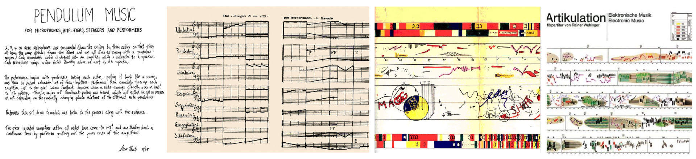
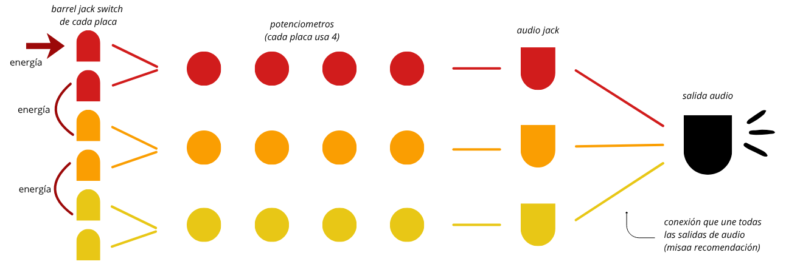
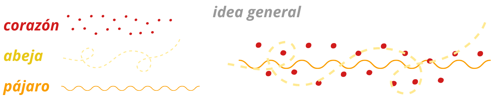

# sesion-13b

Viernes 12 de Junio, 2026. 

Nota del día: llegué muy tarde.

## Referentes (y otras cosas)

- **John Cage** fue un compositor, filósofo y artista estadounidense, una de las figuras más influyentes del siglo XX. Pionero de la música aleatoria, de la música electrónica y del uso no estándar de instrumentos musicales (como el piano preparado), su obra más famosa es *4′33″*, una pieza que consiste enteramente en el silencio ambiental del entorno, desafiando la definición misma de lo que constituye la música.
- **Steve Reich** es un compositor estadounidense y uno de los máximos pioneros del minimalismo musical. Su trabajo introdujo el uso de bucles de cinta adhesiva con desfase (*phasing*) y procesos matemáticos repetitivos aplicados a la percusión y la instrumentación, transformando radicalmente la música contemporánea y sirviendo de base para géneros modernos como el ambient y la electrónica.
- **Yoko Ono** es una artista conceptual, música y activista multimedia japonesa, figura clave en el desarrollo del movimiento vanguardista *Fluxus* en la década de 1960. Su enfoque artístico prioriza la idea o la instrucción por sobre el objeto físico, integrando la música experimental, la performance participativa y el cripticismo poético mucho antes de su salto a la cultura popular masiva.
- **Pendulum Music** es una célebre pieza conceptual creada por Steve Reich en 1968. La obra es una escultura sonora procesual que consiste en suspender varios micrófonos sobre unos parlantes; al ser soltados como péndulos, el movimiento genera acoples de retroalimentación (*feedback*) audibles cada vez que pasan cerca del cono del parlante, creando un ritmo orgánico que se detiene por completo una vez que la gravedad detiene los micrófonos.
- **Lindsay Ellis** es una crítica de cine, ensayista audiovisual y novelista estadounidense, conocida por su influyente trayectoria en YouTube analizando narrativa, cultura pop y medios de comunicación. En su video ensayo sobre Yoko Ono (*"Yoko Ono: El Arte del Insulto"*), realiza una profunda deconstrucción crítica de la misoginia, el racismo y la incomprensión pública que sufrió la artista conceptual, reevaluando su verdadero impacto e innovación en el arte contemporáneo. - <https://youtu.be/SMOABV_zgrk>
- **Manfred Werder** es un compositor y performer suizo fuertemente vinculado al colectivo internacional de música experimental *Wandelweiser*. Su obra explora los límites del minimalismo extremo, el silencio y la ecología acústica, reduciendo a menudo sus partituras a frases poéticas breves o citas literarias que invitan al intérprete a simplemente registrar, activar o escuchar los sonidos naturales que ya existen en el espacio público.

## Qué aprendí hoy

### Partituras 

¿Qué es una partitura?

- Una partitura es un documento escrito, impreso o digital que representa gráficamente una composición musical. Funciona como una especie de "mapa" o "guía" para los músicos, utilizando un sistema de notación universal con signos, símbolos y notas que detallan exactamente qué tocar y cómo hacerlo. (wikipedia)

Para el desarrollo del proyecto 03 hay que pensar fuera de lo que convencionnalmente se conoce como partitura ya que hay muchas formas de escribir la música (para todo lenguaje, hay variaciones): 

Puede ser representado como: 

- instrucciones. 
- dibujos.
- reglas.
- palabras.
- sonidos.
- entre otros. 

Partitura general como un sistema completo (pero recordar: **todo sistema tiene un limite**!!)

## Qué hice hoy

Avance proyecto 03. 

Primero terminamos de definir que placas vamos a utilizar para desarrollar nuestro sintetizador. 

- Barry benson (Abeja) - percutor.  
- Lub-dub (Corazón) - percutor. 
- Chirihue Mecanizado (Pájaro) - oscilador. (<https://github.com/terroiblea/dis8644-2026-1-procesos-2/tree/main/00-proyecto-02/grupo-04>)     

La idea es generar una especie de ecosistema (abeja + pájaro), por lo mismo todo suena superpuesto (sonidos independientes).

Para unir todo utilizaríamos más o menos un sistema así: (considerando partes de unión y partes que se manejan de forma extersa cuando este la carcasa)

El próximo martes podrían llegar las placas (yeih), así que de momento tenemos que pensar en las otras partes del proyecto hasta que podamos soldar. Por lo mismo, ahora comenzamos con el desarrollo del BOM, tomando como base el que ya habíamos realizado en el proyecto 02.

De momento va algo así: 

| Componente | Cantidad | Precio (c/u) | Comprar |
|------------|----------|--------------|---------|
| Chip 4069UBE | 1 | $1.100 | <https://www.cabezacuadrada.cl/product/cd4069/> |
| Chip CD40106BE | 3 | $750 | <https://www.cabezacuadrada.cl/product/cd40106be/> |
| Chip LM324 | 1 | | | |
| Potenciómetro 100K | 8 | $490 | <https://www.mechatronicstore.cl/potenciometro-rotacional-10k/> |
| Potenciómetro 250K | 4 | $495 | <https://altronics.cl/potenciometro-lineal-250k-b250k> |
| Capacitor no polarizado 100nF | 6 | $100 | <https://www.mechatronicstore.cl/condensadores-ceramicos-distintos-valores/> |
| Capacitor no polarizado 10nF | 1 | $100 | <https://www.mechatronicstore.cl/condensadores-ceramicos-distintos-valores/> |
| Capacitor polarizado 10uF 50V | 6 | $100 | <https://www.mechatronicstore.cl/condensador-capacitorio-de-electrolitico-por-unidad-varios-valores/> |
| Capacitor polarizado 0.22uF 50V | 1 | $100 | <https://www.mechatronicstore.cl/condensador-capacitorio-de-electrolitico-por-unidad-varios-valores/> |
| Capacitor polarizado 100uF 50V | 4 | $100 | <https://www.mechatronicstore.cl/condensador-capacitorio-de-electrolitico-por-unidad-varios-valores/> |
| Capacitor polarizado 1uF 50V | 1 | $100 | <https://www.mechatronicstore.cl/condensador-capacitorio-de-electrolitico-por-unidad-varios-valores/> |
| Resistencia 100K | 1 | $100 | <https://www.mechatronicstore.cl/resistencias-electricas-1-2-w-1-unidad/> |
| Resistencia 1K | 4+5* | $200 | <https://www.mechatronicstore.cl/resistencias-electricas-3w-por-unidad/> |
| Diodo 1N4007 | 2 | $200 | <https://www.mechatronicstore.cl/diodo-rectificador-in4007-1n4007-4007/> |
| LED 3mm/5mm | 5 | $100 | <https://www.mechatronicstore.cl/led-3mm-5mm/> |
| Regulador de voltaje L7805 | 2 | $490 | <https://www.mechatronicstore.cl/regulador-limitador-de-voltaje-5v-dc/> |
| Chip CD4070BE | 1 | - | <https://www.mouser.cl/ProductDetail/Texas-Instruments/CD4070BE?qs=5WY7Uqh921w5Ya0dPgjorQ%3D%3D> |
| Barrel Jack Switch | 6 | — | Extraídos del LID |
| Switch 2 pines, 2 posiciones | 2 | $570 | <https://www.katode.cl/switches/1339-interruptor-switch-2-pines-on-off-corto.html> |

### Ideas generales de partituras desarrolladas hasta el momento: 

**Partitura 1:** instrucciones escritas. 

(desarrollo idea general)

- 08:00 a 12:00: El pajarito canta rapido pero volumen bajo , la abeja esta rapida pero suena bajito, y el corazón está rápido.
- 12:01 a 16:00: pajarito full, abeja más lenta pero suena más fuerte, y el corazón más lento.
- 16:01 a las 20:00: pajarito canta lento y bajo volumen, la abeja muy lenta pero harto volumen, el corazon harto volumen pero mas lento.
- 20:01 a las 07:59: Pajarito no canta, abeja en silencio y corazon muy lento y volumen un poco mas bajo.

**Partitura 2:** diagrama/dibujo. 

- El corazón son puntos (un latido es como un golpe repetitivo, diagramarlo serían como puntos/los golpes representados), la abeja es un camino curvado con linea discontinua, el pajaro todavia no sé como se podría diagramar pero de igual forma tendría su propio lenguaje expresivo. Seria genial que cada uno tengo su propio color para poder diferenciarlo cuando esten superpuestos (por que van as onar de forma indepebndiente pero al mismo tiempo, superpuestos).
- Corazón rojo, abeja amarilla y pajaro naranjo. Desgloce de tonos calidos.

## Encargo-13b 

Leer capítulo 3 y 4 del libro Pomelo de Yoko Ono, compartir apuntes y reflexiones críticas sobre el texto, prohibido usar inteligencia artificial, no sirve para este ejercicio.

### Capítulo 3: Evento. 

### Capítulo 4: Poesía. 

