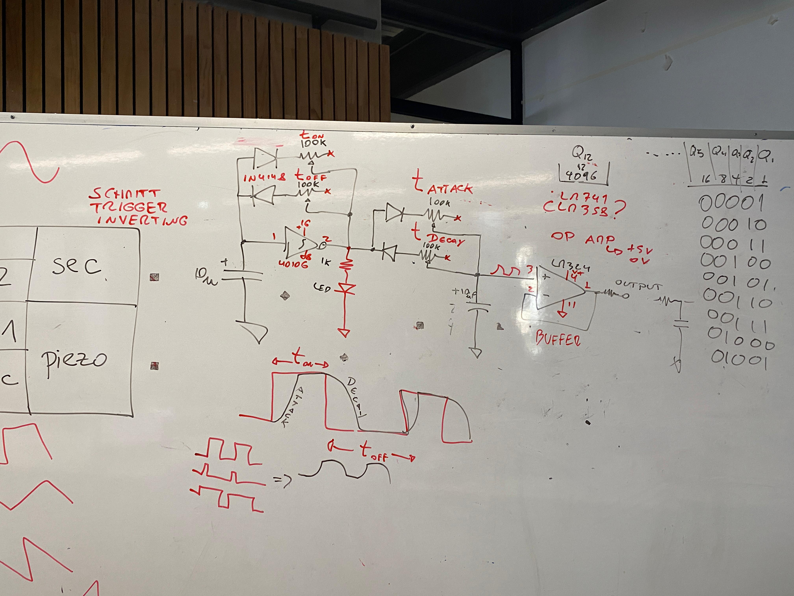

# sesion-10b
22 de mayo del 2026

Hola profe Misa, Aarón y Emi.  
Update: Estoy re obsesionado con “Los Jaivas”.   
*(Gracias profe Aarón por la recomendación).* 

Veamos que tenemos para hoy:

1.	Definiciones vistas en clase; Electrónico y electricidad.
2.	¿Qué es fenomenología? 
3.	Trabajo en clase, proyecto para solemne 02. 
4.	Flusser, cap. 6, 7

## 1.	Definiciones vistas en clase; Electrónico y electricidad.

`Electricidad:`  
**“La electricidad es una forma de energía que fluye a través de los conductores,** como cables y circuitos, permitiendo que los dispositivos funcionen y las luces se enciendan. Es una fuerza fundamental de la naturaleza que está presente en todo nuestro entorno”. (Aviation group)

`Electrónico:`   
“La electrónica es una rama de la ciencia y la ingeniería **que se ocupa de los circuitos, los componentes y los sistemas que utilizan y controlan la electricidad para realizar funciones específicas.** Es el campo que hace posible la creación y el funcionamiento de una amplia variedad de dispositivos y tecnologías que utilizamos en nuestra vida diaria”. (Aviation group)

***Un ejemplo sencillo, es el de un Bombillo; La electricidad es la energía que corre por todo el circuito y hace que exista esa luz que podemos ver, y la electrónica, es toda esa composición y creación de ese circuito para que la electricidad pueda pasar, incluso hasta el interruptor.***

> https://www.aviationgroup.es/actualidad/diferencia-electricidad-electronica/

## 2.	¿Qué es fenomenología?
> “La fenomenología es una rama filosófica que trata de comprender y darle importancia a cómo las personas vivimos el mundo en el que vivimos, tanto en cuanto a sus aspecto más físico como en términos de interacción social y emocionalidad.” (Rubio, 2026) 
>> *(Este concepto lo nombro el profesor Missa, en complemento de la retroalimentación de la lectura del día…)*

## 3.	Trabajo en clase, proyecto para solemne 02. 

Para nuestro proyecto solemne, vamos a hacer un sintetizador modular, en la que cada grupo que se formó para este proyecto, tiene partes del sintetizador muy importantes, y en este caso en mi grupo escogimos el Oscilador 2.

#### Propuesta oscilador 1:   
Con esta opción podremos generar ondas cuadradas y ondas de diente de sierra.

`Chip`: 40106
`Amplificador`: LM 324

*Esquema realizado por mi profesor Missa, para ayudarnos con una explicación*

Propuesta oscilador 2: Con esta opción podremos generar ondas cuadradas y ondas de diente de sierra también, pero con este chip, todo suena más agresivo.

`Chip`: 4051

## 4.	Flusser, cap. 6, 7

**Capítulo 6:La distribución de la fotografía.**

Este capítulo, al igual que el anterior, estuvo muy entretenido y bonito, pues en síntesis habla sobre el valor de los objetos “tangibles”, desde un sticker de una lata de comida, hasta un barco en el mar…, todo tiene una historia, y de alguna u otra manera, información. 

El autor hace una breve introducción, en la cual habla sobre la distribución de la fotografía y lo fácil que es porque esta no requiere de tecnologías o espacios y fuerzas físicas para hacerlo, se puede hacer mano a mano (como un volante), además de su facilidad para ser almacenadas. Y ahora que mencionamos la distribución, el autor ahonda en la “distribución de información”, diciendo que en la naturaleza naturalmente la información se desintegra como un proceso común y normal; por ejemplo, las hojas de los árboles o los troncos que guardan información, y esta se comienza a desaparecer con el tiempo, pero los seres humanos se han opuesto a esta tendencia de la desintegración de la información, haciendo y transmitiendo esta misma, y a su vez produciéndola intencionalmente. Todas esas acciones mencionadas anteriormente, producen lo que llamamos “cultura”. El autor, luego dice que la comunicación es en realidad manipulación de la información, y para que la comunicación se pueda dar, se necesita un emisor y un receptor, y esta consta en 2 partes: se produce la información (dialogo) y segundo, se distribuye a las memorias, donde se almacena (discurso). Bien, anteriormente mencione que se necesitan 2, pero el dialogo también puede ser con uno mismo. En el discurso (que es la segunda parte), si se necesita del otrx.

Luego, el autor habla sobre los 4 métodos de discurso y la cultura que se produce alrededor de estos; Responsabilidad, autoridad (nuestros superiores), progreso (como los discursos científicos), masificación (los medios de comunicación masivos), y es aquí donde el autor dice que las fotografías pueden ser tratadas de manera relativa al dialogo o la discusión. Esta relación también existe por la facilidad de distribución de información encapsulada en una imagen, así mismo como lo es un mensaje de voz a voz…, aunque claro, el proceso de codificación de las imágenes puede llegar a ser un poco más lento. También, esta facilidad de distribución viene de que las fotografías se pueden adaptar a cualquier tipo de superficie para poder tener “un lugar”, a esto se le suma que son independientes de la hoja donde se puedan reproducir, sin necesidad de otros intermediarios; como la hoja o otras maneras…, por ejemplo, el video que, si o si necesita un soporte tecnológico como pantalla, etc, para poder ser distribuido. Es aquí donde el autor dice como un contra de la distribución de las imágenes, puesto que dice que la reproducción de estas, son una ilusión ya que los elementos originales no se pueden distribuir de manera física o literal, pero con las fotografías, si se puede hacer…, pero dejan de ser originales. 

Continuando con la lectura, el autor comienza a plasmar una diferencia de valor de la fotografía, y es que el valor de estas en cuanto a objeto, es casi que desprovisto, es una “hojilla” como dice él. El verdadero valor esta en la información que posee esa “hojilla”. Lo valioso es la información, no el objeto o la cosa. Pero, aquí el autor marca una línea de no desprecio a los objetos (en este contexto, industriales), pues estos también poseen valor e información; principalmente es valioso por su forma física e improbable de encontrar en la naturaleza, pero a diferencia de la fotografía, la información en estos objetos esta casi que implícita y combinada con el objeto en si mismo, y la única manera de descubrir esta información, es desgastando, consumiendo o destruyendo el objeto. Por eso son valiosos en cuanto a objeto literal. Además, el concepto de la información en la fotografía es muy poderoso, porque estas ponen en evidencia la decadencia de lo material, de las cosas, y en consecuente, la idea de propiedad; “no es poderoso quien posee la fotografía, sino quien produce la información que la fotografía contiene”. Para ir culminando, el autor más adelante también nos habla sobre como las fotografías pueden cambiar su significado dependiendo del contexto en el que se encuentren, y su decodificación puede crear varios escenarios.

**Capítulo 7:  La recepción de la fotografía**

Este capítulo me pareció muy interesante porque complementa todo lo que el autor ha venido diciendo sobre las fotografías, pero esta vez enfocándose en quienes las observan. Hasta ahora habíamos hablado de la cámara, el fotógrafo y la fotografía misma; ahora el autor dirige la atención hacia la persona que recibe y observa las imágenes. El autor comienza diciendo que una fotografía no tiene significado por sí sola, sino que necesita ser recibida e interpretada por alguien. Esto significa que la imagen no está completa cuando se toma, sino cuando una persona la observa y le atribuye un sentido. Sin embargo, aquí surge un problema: la mayoría de las personas observan las fotografías de manera ingenua, como si fueran ventanas directas al mundo real (asumen de manera literal). Es decir, se suele asumir que una fotografía muestra la realidad tal cual es, cuando en realidad ya sabemos por los capítulos anteriores que está mediada por las decisiones del fotógrafo y por el programa de la cámara.

A partir de esto, el autor explica que la recepción de la fotografía depende de la capacidad del observador para descifrarla. No basta con mirar una imagen; es necesario preguntarse quién la tomó, por qué fue tomada, qué elementos fueron incluidos o excluidos y qué intención existe detrás de ella. De alguna manera, el espectador debe hacer el camino inverso al que hizo el fotógrafo al momento de producir la imagen. Además, el autor plantea que las fotografías terminan organizando nuestra memoria y nuestra forma de entender el mundo. Muchas veces conocemos personas y/o lugares únicamente a través de fotografías, por lo que nuestra experiencia de la realidad se encuentra mediada por ellas. Esto les da un enorme poder, porque no solo muestran información, sino que también influyen en la manera en que construimos nuestros conceptos sobre las cosas.

Para finalizar, el autor menciona que la sociedad moderna consume fotografías constantemente, casi sin detenerse a reflexionar sobre ellas. Las imágenes circulan de forma masiva y son recibidas rápidamente, lo que dificulta su análisis. En consecuencia, el espectador corre el riesgo de convertirse en alguien pasivo que simplemente acepta las fotografías como verdades evidentes, en lugar de cuestionarlas o interpretarlas.
