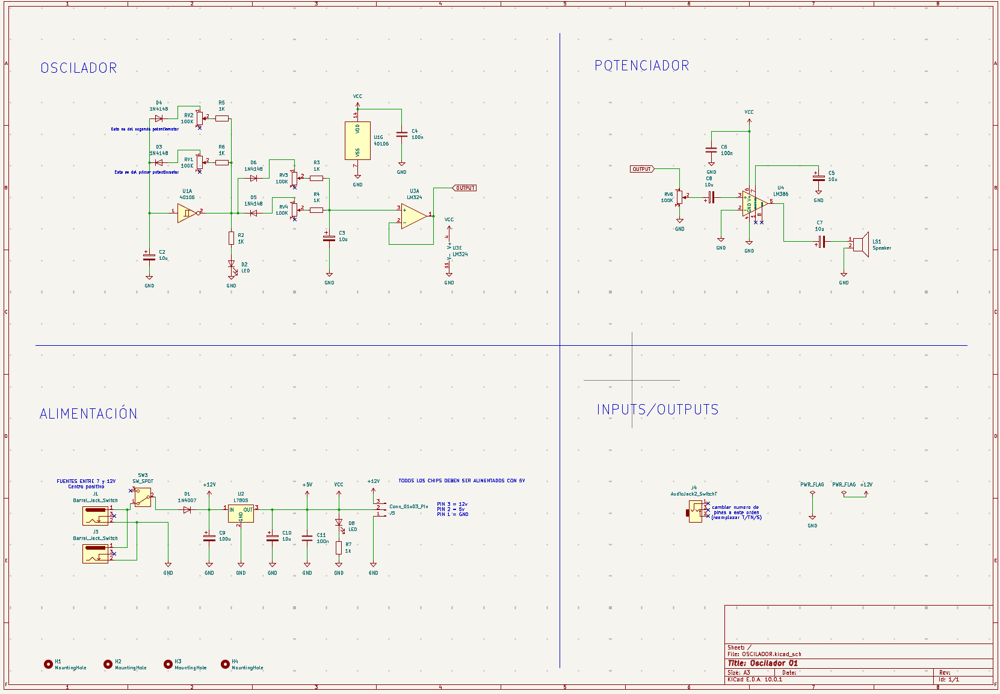
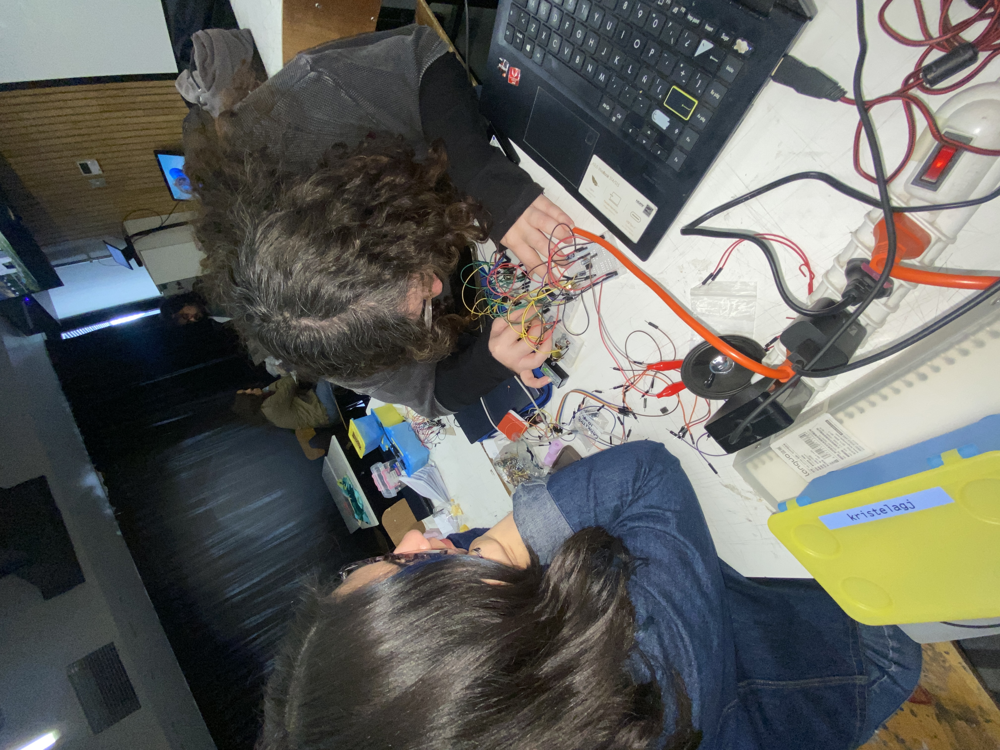
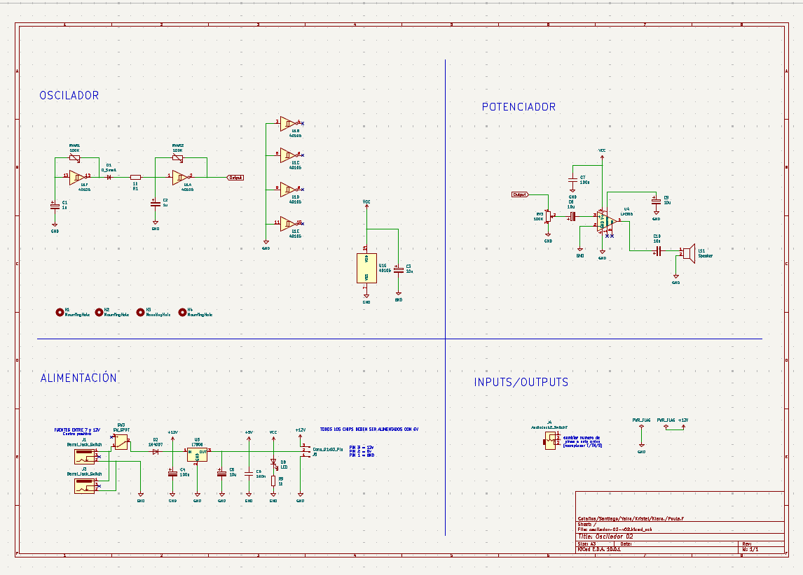
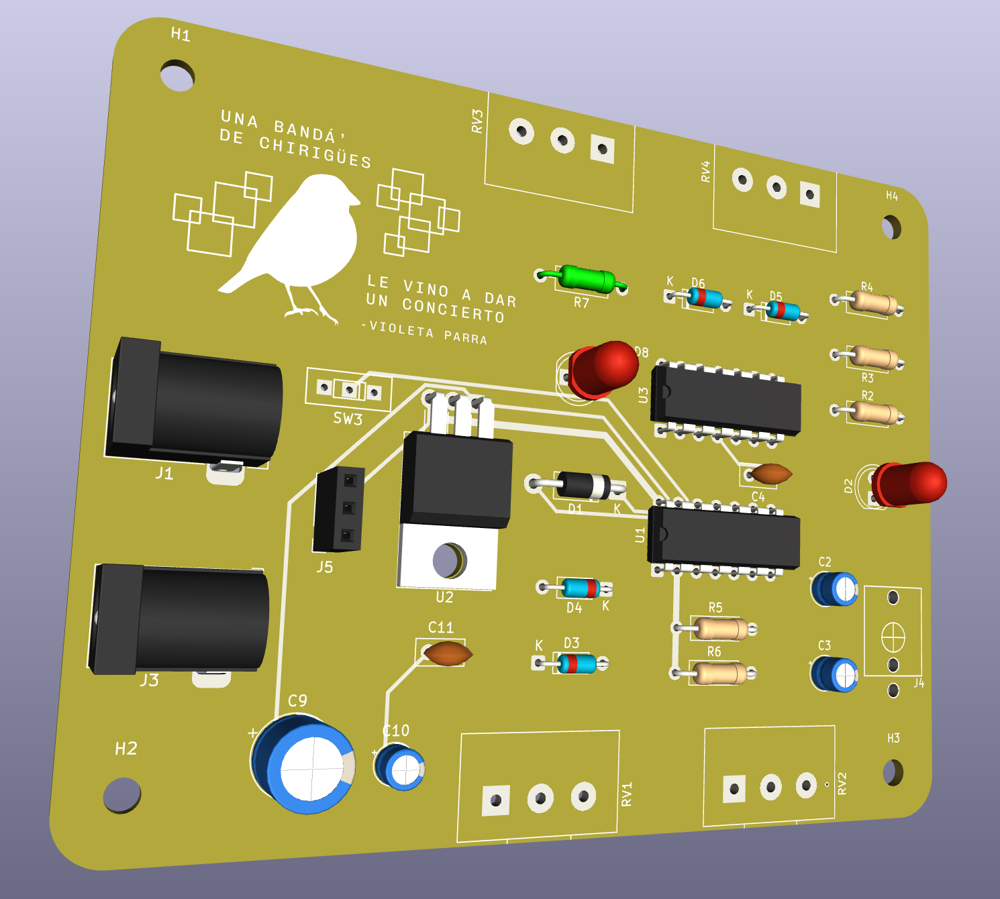
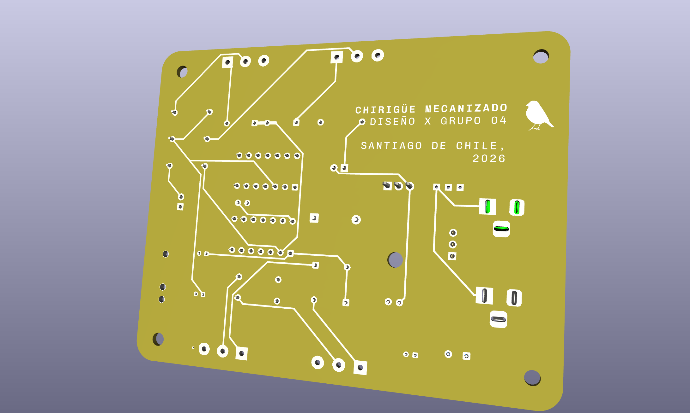
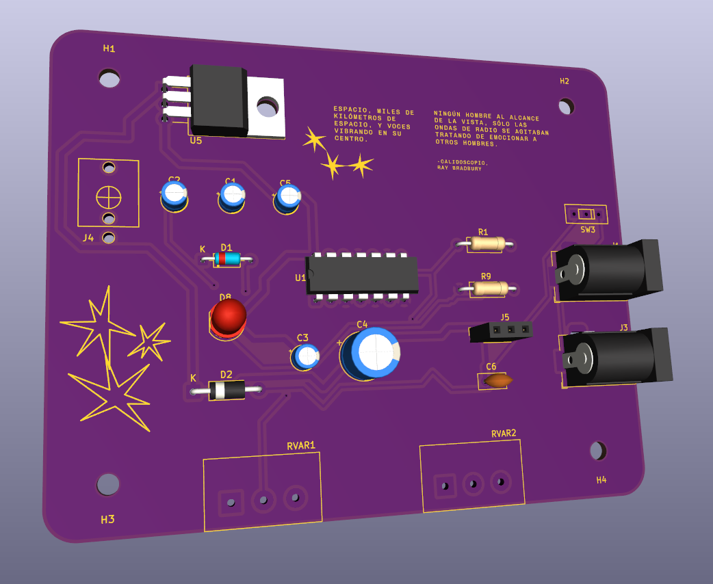
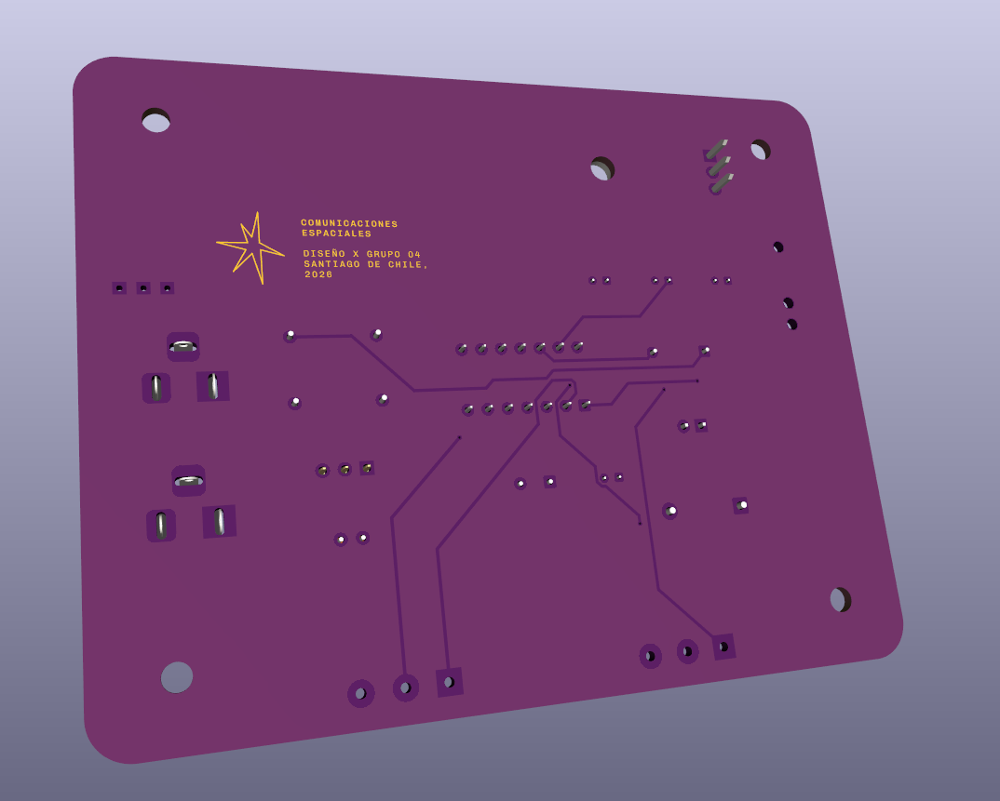

# sesion-12a
**02 de junio del 2026**

Hola profe Aaron, Misa y Emi. Espero que se encuentren muy bien.

La clase del día de hoy, estaba enfocada en revisar las propuestas que teníamos para el próximo proyecto a presentar…, así que veamos que sucedió:

1.	Aplicación de ajustes a propuesta 1, y se dejó lista.  
2.	Problemas con propuesta 2.  
3.	Realización de una nueva propuesta (3), que presentamos como propuesta 2.  
4.	PCB listas para presentación de proyecto.
   
Comencemos c:

## 1.	Aplicación de ajustes a propuesta 1, y se dejó lista.
   
Gracias a la clase pasada, pudimos corregir el esquemático, y hacer que nuestra propuesta 1 (El chirigüe), sonara, pues nuestro error al momento de ejecutar el esquemático en la protoboard, era que los diodos estaban todos hacia la misma dirección, lo cual hacía que estos no cumplieran su función como debían, pues los diodos actúan como compuertas que se abren para que la energía entre, y salga en orden, sin regarse o esparcirse por el resto de los caminos. Aquí esto no iba a suceder, porque todos estaban actuando de entradas..., ¿Y la salida? 

Este oscilador, genera ondas cuadradas, y ondas tipo sierra (con los potenciómetros, podemos generar un ataque y una decaída). 

*(Foto esquemático corregido oficial).*

## 2.	Problemas con propuesta 2.

Nuestra segunda propuesta, fue tomada de https://hackaday.com/2015/02/23/logic-noise-the-switching-sequencer/ y modificada por mi grupo. (Modificamos los condensadores para tener un sonido diferente…, poníamos de 10uf o de 1uf, o de 0,22uf, para tener diversos sonidos).

Lo que sucedió, fue que luego de diversos intentos armando y realizando este esquemático, obtuvimos el ruido, obtuvimos por un momento oscilaciones, obtuvimos casi todo por un momento…, pero fue eso, solo un momento. Luego, no nos funcionaba en la protoboard…, a veces sonaba, pero no realizaba nuestro objetivo esperado, el cual era la oscilación, solo producía un ruido constante. 

Después de muchas revisiones, de llevar el circuito a casa, y ser chequeado en oportunas veces, tampoco funcionaba (Parte de la causa, era que el chip 4040, se nos había quemado). Así que luego decidimos abandonar el esquemático, porque nos estaba haciendo perder mucho tiempo (que a la larga terminan siendo aprendizajes), y debíamos continuar. Buscamos otro esquemático que en su realización fuera más sencillo de comprender e interiorizar para el poco tiempo que teníamos ahora. 

Este oscilado generaba ondas cuadradas.

## 3.	Realización de una nueva propuesta (3), que presentamos como propuesta 2.

Esta propuesta, la tomamos de: https://hackaday.com/2015/02/04/logic-noise-sweet-sweet-oscillator-sounds/, y su elección fue porque gracias al oscilador 1 (la propuesta 1), ya conocíamos el chip 40106, y este circuito, solo ocupa este chip, así que en relación al tiempo, tomamos este circuito y lo ejecutamos. 

El circuito nos funcionó, y sonaba, pero luego dejo de hacerlo, y fue porque se nos quemó la protoboard, pero no sabíamos…, y de nuevo, se había vuelto armar y desarmar jajaja. Cambiamos la protoboard, y fue así como comenzó a oscilar, sonar y todos volvimos a ser felices de nuevo.

Para obtener un sonido diferente, cambiamos los condensadores de 100uf por condensadores de 1uf, pues los de 100uf, hacían que las oscilaciones fueran más lentas, y a su vez, más graves…, cuando lo cambiamos a condensadores de 1uf, fue todo lo contrario, las oscilaciones eran más rápidas, más ruidosas, e incluso, el tono era más agradable. 

Slay.

## 4.	PCB listas para presentación de proyecto.
-	Propuesta 01: Chirihue Mecanizado

-	Propuesta 02: Comunicaciones espaciales

Fin c:
