# sesion-14a
**16 de junio del 2026**

¡Hola profe Aarón, Misa y Emi!, antes de continuar con los registros de esta bitácora, quiero agradecerles por todo. Sinceramente, el curso, lo aprendido hasta ahora, y ustedes, me han llenado el corazón a punto de reventar. Gracias, por tanto. 

Continuando con la programación habitual, veamos que sucedió el día de hoy:

1.	Le dimos la bienvenida a nuestras placas…, nuestras hijas.  
2.	Aprendimos y enseñamos a soldar. Soldamos.  
3.	Preparación para presentación del proyecto 03.  
4.	Ono, cap. 5, 6  

Comencemos c:

## 1.	Le dimos la bienvenida a nuestras placas…, nuestras hijas. 

Las placas llegaron a la Universidad Diego Portales el lunes 15 de junio, y el martes 16 de junio, se nos fueron repartidas oficialmente a todo el salón. 

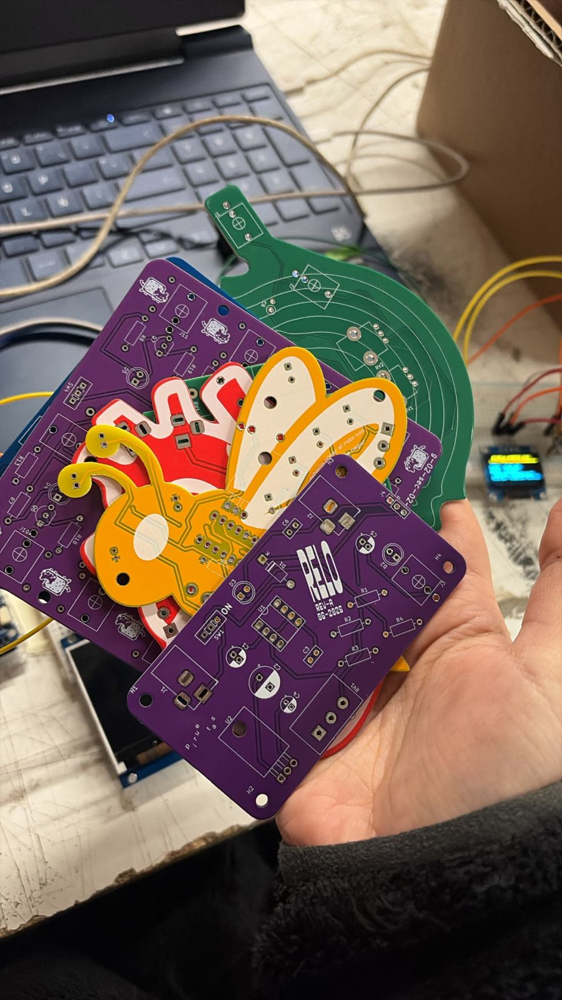

## 2.	Aprendimos y enseñamos a soldar. Soldamos.  

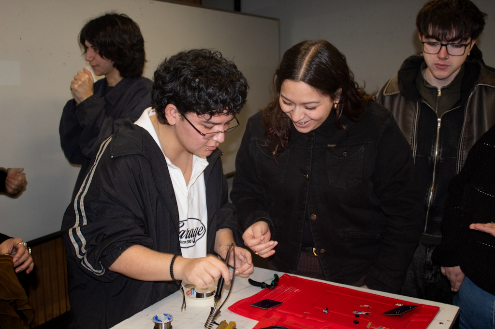
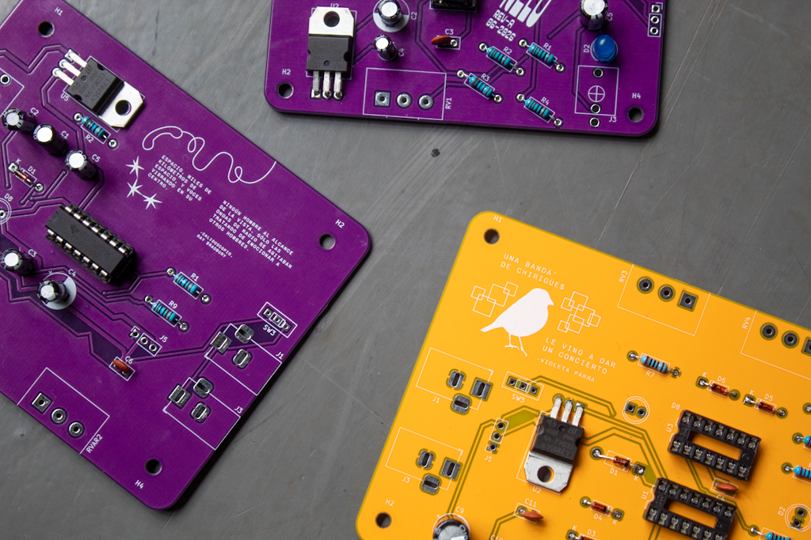
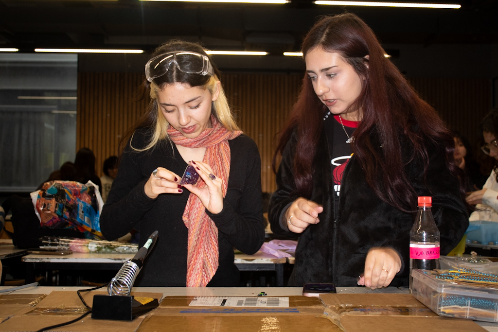
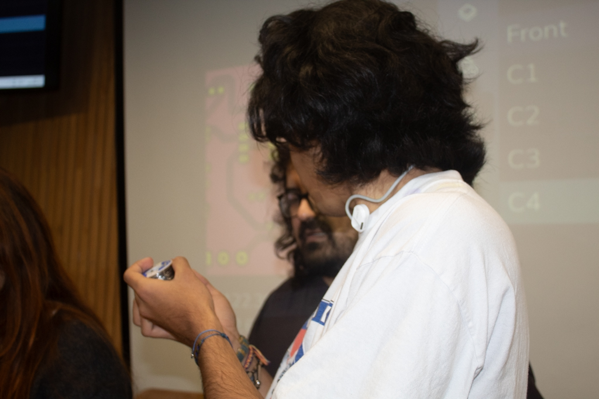
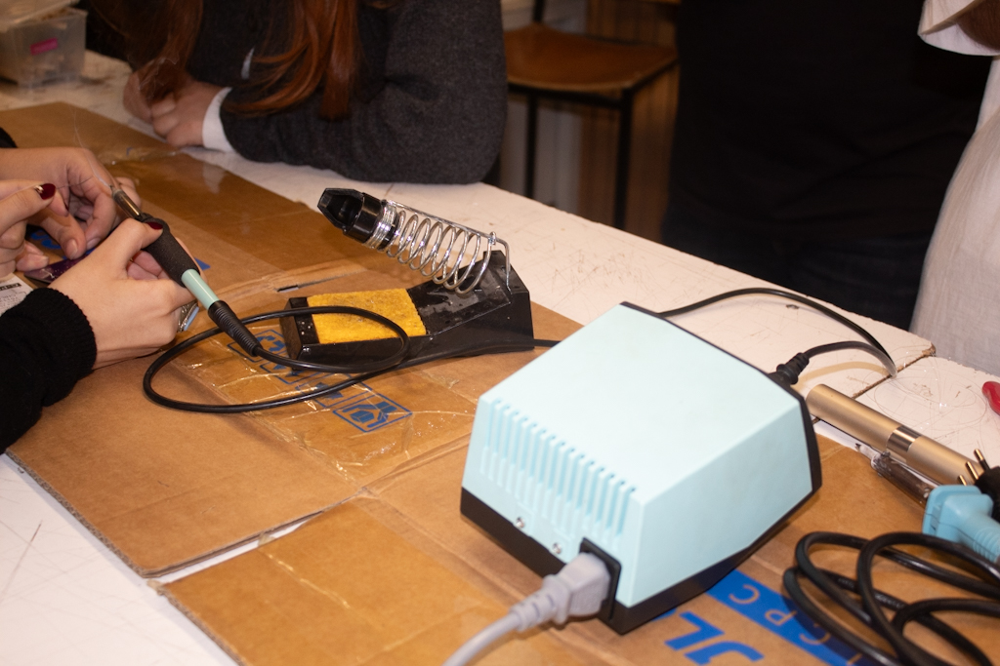
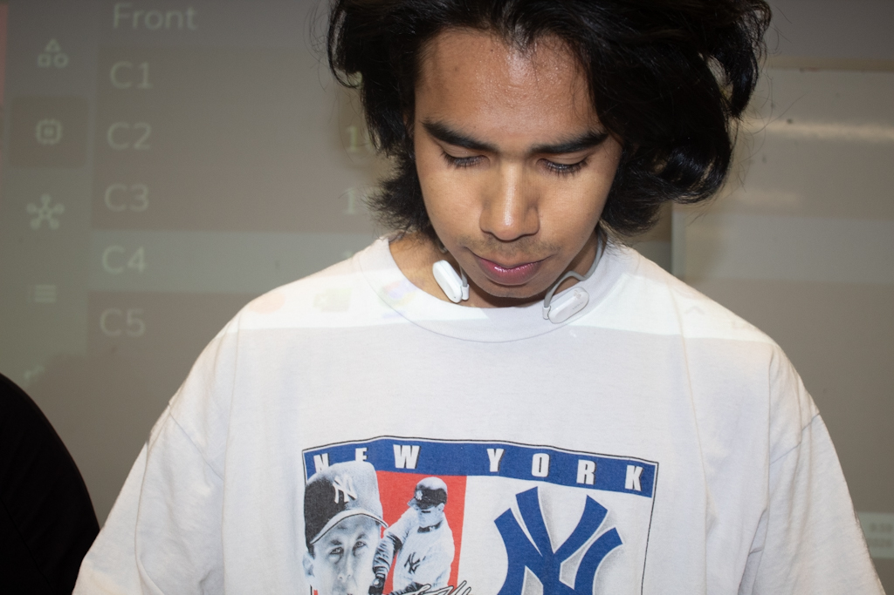
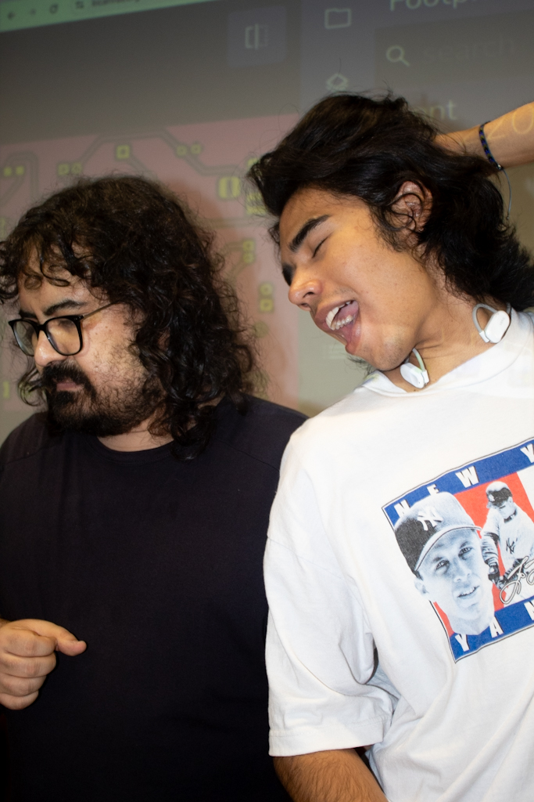
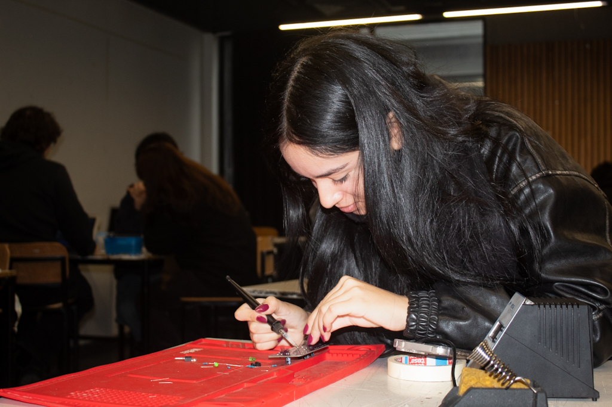
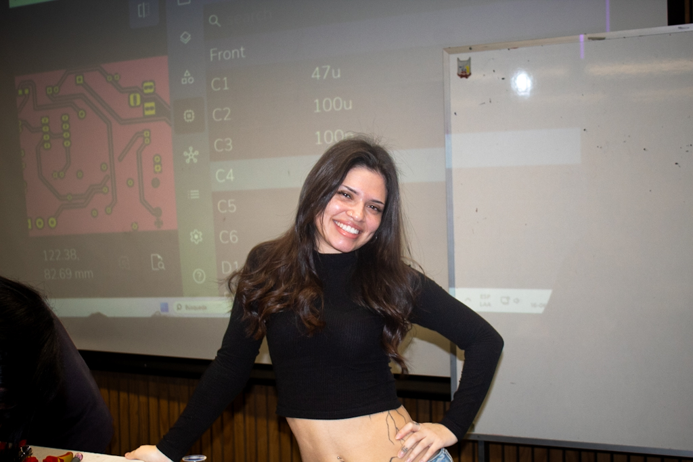
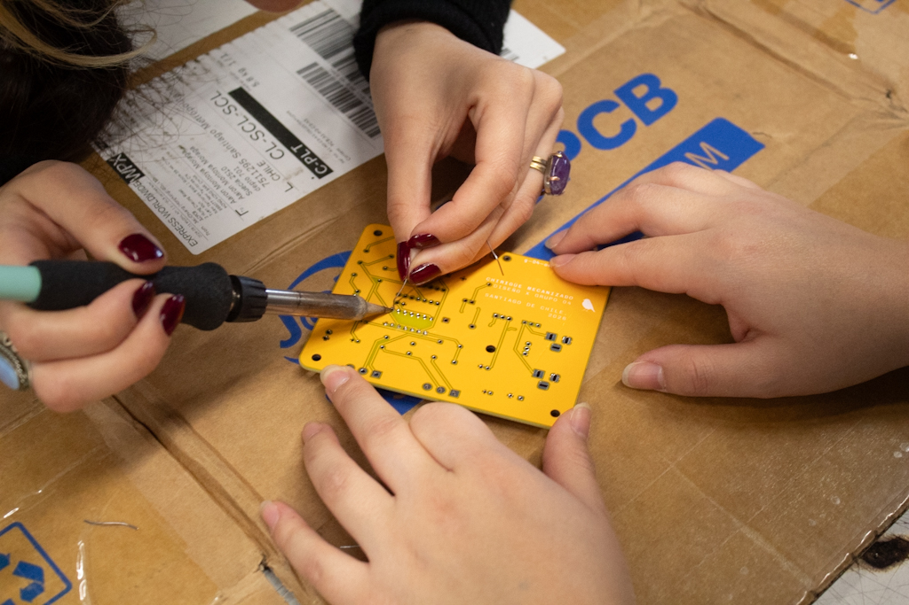
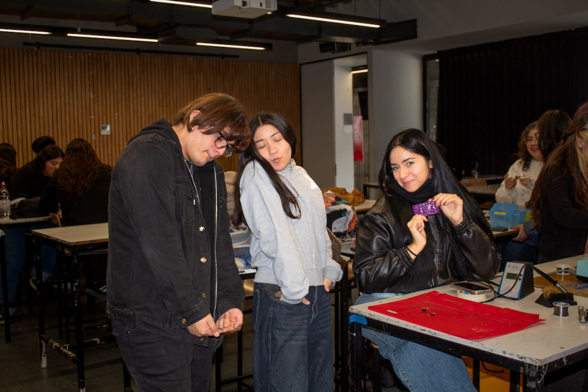
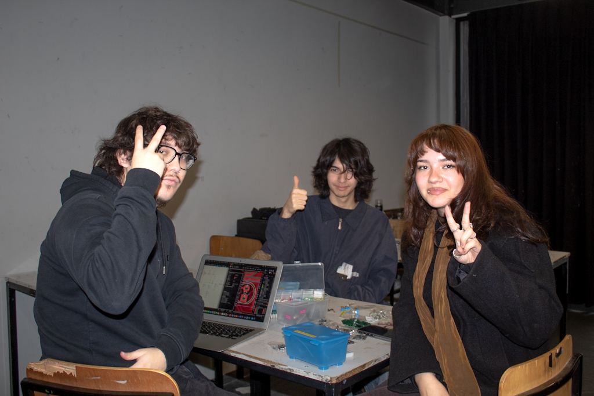
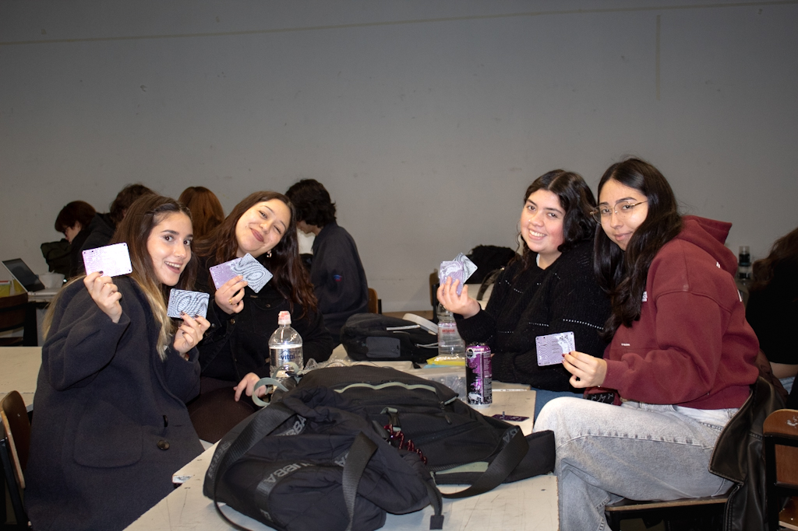
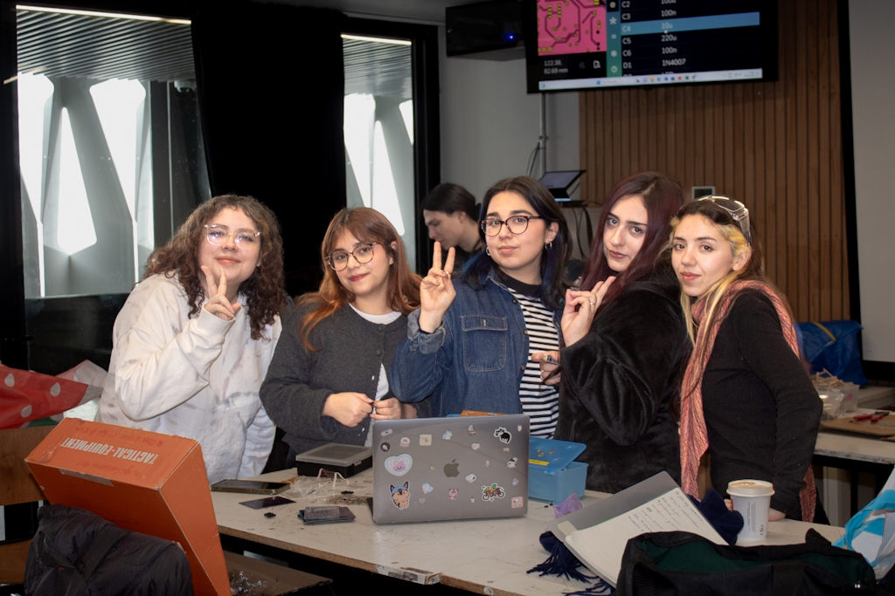

## 3.	Preparación para presentación del proyecto 03.  
## 4.	Ono, cap. 5, 6  
