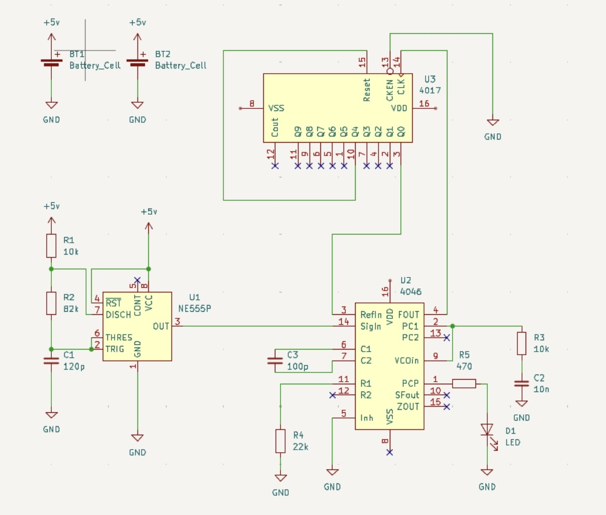

## sesion-11a
# Chips y voltajes de operación

- **CD4046 (PLL + VCO)**
  - Rango: **3 V – 18 V**
  - Usos: multiplicador de frecuencia, demodulación FM, conversor tensión–frecuencia

- **NE555P (Timer)**
  - Rango: **4,5 V – 16 V**
  - Usos: retardos precisos, pulsos, oscilaciones

- **CD4017 (Contador Johnson / divisor de décadas)**
  - Rango: **3 V – 15 V** (hasta 18 V según fabricante)
  - Usos: secuenciadores de luces, temporizadores, contadores

- **CD40106 (Hex Schmitt Trigger Inverter)**
  - Rango: **3 V – 18 V**
  - Usos: filtrado de ruido, osciladores simples con R + C, generadores de onda cuadrada

---

- **Eurorack (Doepfer, 1995)**
  - Formato estandarizado de sintetizador modular
  - Cada módulo tiene dimensiones y consumo eléctrico estrictos
  - **ModularGrid**: plataforma virtual para planificar racks reales

- **Conectores y alimentación**
  - **Barrel_jack_switch**: entrada de alimentación con interruptor
  - **SW_SPDT**: interruptor de dos posiciones
  - **Audiojack 2**: conexión de señal de audio

 ## Opciones de solemne osciladores :)))
  Bueno aquí tenemos opciones de osciladores que vimos con mi grupo:
 - **Opción 1**: CD4046 + NE555P + CD4017
  - Orientado a osciladores controlados por voltaje y secuenciadores
- **Opción 2**: CD4046 + CD40106
  - Orientado a osciladores simples con Schmitt Trigger y VCO
  - Hicimos solo los esquematicos, ya que nos faltaban materiales para hacerlo en las protos

 
 

    

