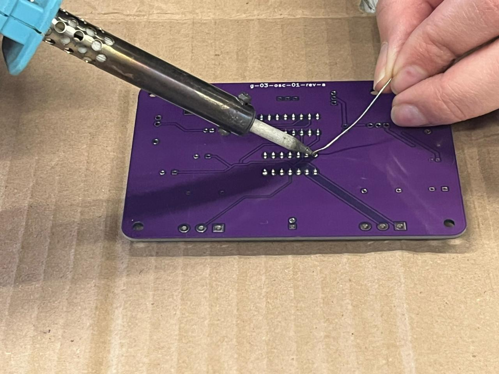
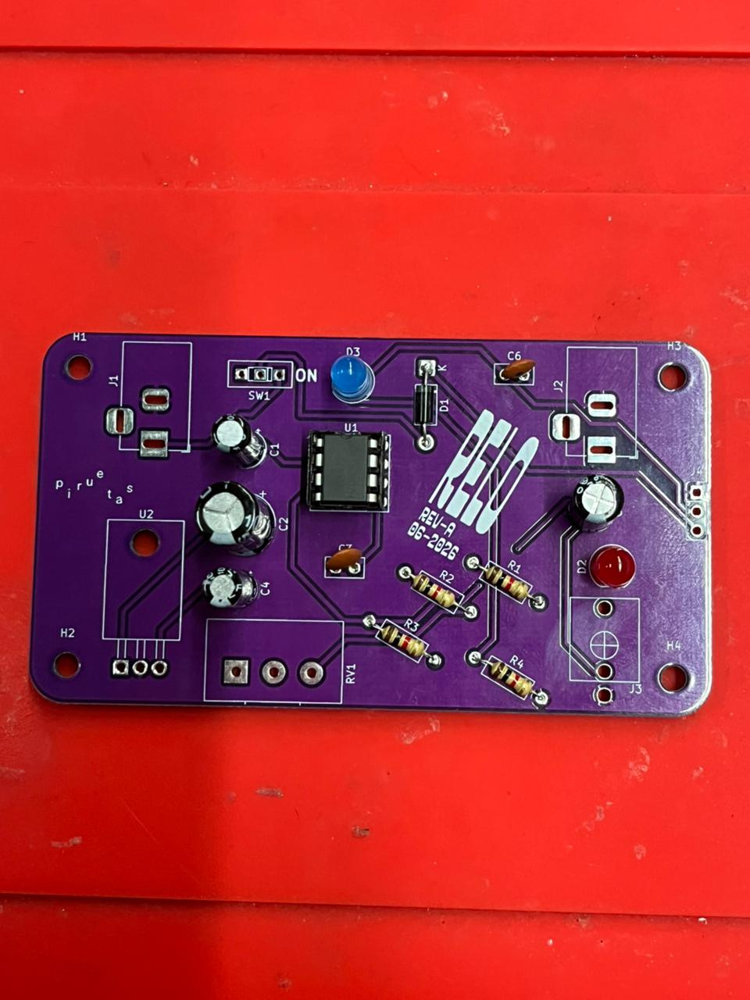
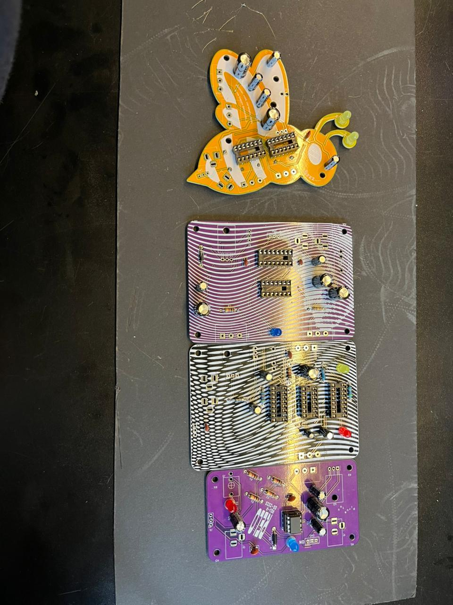

# sesion-14a

 ## Trabajito en clases :)

En esta clase nos dedicamos a trabajar en el último proyecto antes del examen. Áreas de soldado para poder empezar a ensamblar nuestras placas, con mi grupo decidimos utilizar nuestras dos versiones de osciladores y una de percusión del grupo 06. Logramos soldar todos los componentes a las placas de forma correcta y también el RELO.
 
 
 
 
 
 
Cap 5

Cuando leí el capítulo de Objetos en Pomelo, lo que más me quedó dando vueltas fue la Pieza de Quemar. Yoko dice que hay que hacer algo elaborado una autobiografía, un bordado, una silla tallada y después quemarlo, mirando cuánto se demora en arder. Esa idea me pegó fuerte porque normalmente uno hace cosas para que duren, pero acá la gracia está en ver cómo se destruyen. La obra no termina cuando la construyes, sino cuando se convierte en ceniza. Es como si el fuego fuera parte del arte, mostrando lo frágil que es todo lo que hacemos.

Me recordó mucho a mis clases de cerámica. De hecho, ayer me enteré que una de mis piezas explotó en el horno y lo pasé pésimo. Sentí que todo ese trabajo se había perdido en un segundo. Pero recién ahora, hace unos minutos, terminé otra pieza y me di cuenta de que ese proceso el fracaso, la espera, el volver a intentarlo también es parte de la creación, el valor no está solo en el resultado final, sino en aceptar que las cosas pueden romperse, transformarse o desaparecer.

Pucha, lamentablemente siempre pensamos solo en lo positivo, en lo perfecto, en que todo va a salir bien. Pero no nos detenemos a considerar que también pueden pasar cosas malas, inesperadas, en cualquier ámbito: no solo en los objetos, también en las personas, en las relaciones, en la vida misma. Yoko me hace ver que lo que se rompe, lo que se quema o lo que se pierde también tiene sentido, también nos enseña.

Al final, siento que este capítulo habla de la vida misma. Uno se esfuerza, construye, se dedica, pero nada es eterno

cap 6

Yoko no está hablando de películas en el sentido clásico. Sus guiones son instrucciones que parecen absurdas, como pedirle al público que corte la parte de la pantalla que no le gusta o que cierre los ojos cuando aparezca cierto color. Todas forman parte de la historia.
Lamentablemente todo se desgasta sin que lo notemos, poco a poco todo se vuelve más lento, hasta que llega el final sin aviso.
