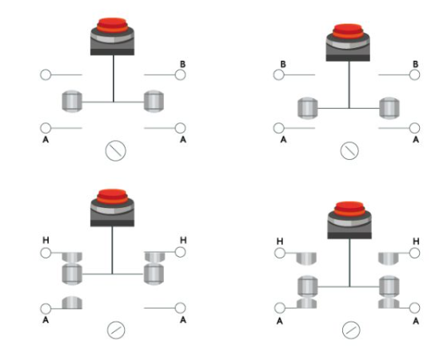
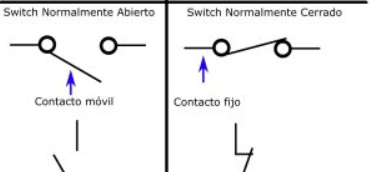
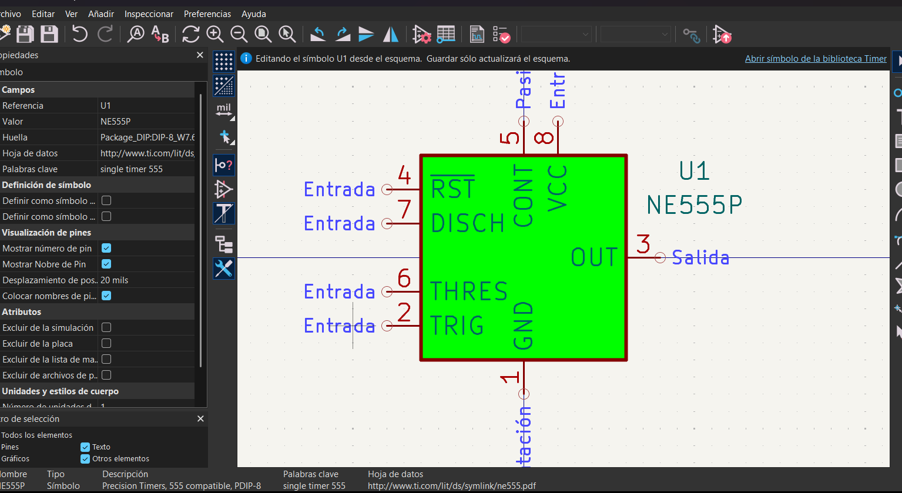
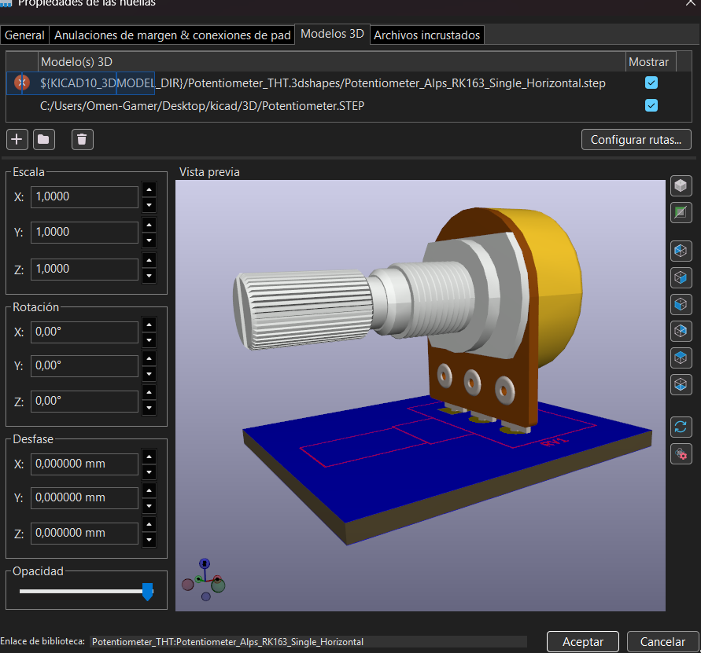
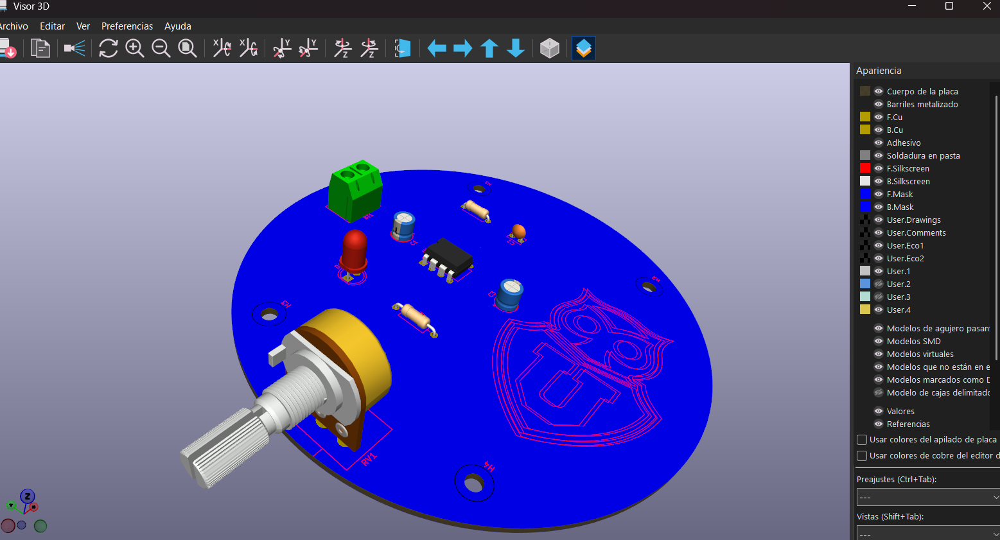

# sesion-09b

15-05-2026

## Apuntes de clase

En esta clase repasamos dudas, preguntas y algunos problemas que teníamos al trabajar con **KiCad**, reforzando conceptos básicos relacionados con botones, símbolos y visualización de modelos 3D.

---

## Botones e interruptores

Luego del repaso general, hablamos sobre la **distinción entre botones e interruptores**, entendiendo sus usos y comportamientos.

### Botones (momentáneos)
Son elementos que solo actúan mientras se mantienen presionados.

- Temporales  
- Pulsadores  
- Timbres  
- Push buttons  
- Normalmente abierto (NO)  
- Normalmente cerrado (NC)

### Interruptores (permanentes)
Mantienen su estado hasta que se vuelven a accionar.

- Interruptor de palanca  
- Switch  

El interruptor más común que utilizamos es el **interruptor simple**, que en KiCad se puede buscar como:
- `SW_SPST`
- `SW_SPDT`

A estos símbolos les asignamos generalmente la huella: Button_Switch_THT:SW_PUSH_6mm

---

### Edición de símbolos

Los símbolos pueden personalizarse directamente desde el esquemático:

1. Seleccionar el componente.
2. Presionar la tecla **E**.
3. Elegir la opción **Editar símbolo**.

Desde este panel es posible:
- Modificar la posición de los pines.  
- Cambiar colores.  
- Agregar comentarios o etiquetas para entradas y salidas.  
- Ajustar distintos parámetros del símbolo según sea necesario.

---

### Modelado 3D

Para visualizar modelos 3D de componentes que no vienen incluidos por defecto en KiCad:

1. Abrir el archivo `.kicad_pcb`.
2. Seleccionar el elemento al que se le quiere asignar un modelo 3D.
3. Entrar a **Propiedades de huella**.
4. Ir a la opción **Modelo 3D**.
5. Cargar el archivo del modelo (preferentemente en formato `.step`, que es el más compatible).
6. Ajustar la posición, rotación y orientación del modelo hasta que coincida correctamente con la huella.

Este proceso permite una mejor visualización y verificación del diseño antes de la fabricación.

---

#### Encargo Lectura, Cap 2 y 3

Los capítulos 2 y 3 me hicieron reflexionar sobre la importancia de vivir y disfrutar el momento, en lugar de estar constantemente mediado por un dispositivo. Personalmente, no me gusta sacar fotos ni grabar videos, porque siento que hacerlo me saca del presente y me obliga a vivir la experiencia a través de una pantalla. Muchas veces, después de un evento o de distintas ocasiones, me preguntan si tomé fotos o grabé algo, y casi siempre la respuesta es no. Esa insistencia me incomoda, porque la distracción del dispositivo rompe la experiencia y transforma el momento en algo que ya no se vive, sino que solo se registra. Prefiero quedarme con la vivencia directa antes que con una imagen que, al final, está condicionada por un aparato y su programa. 
