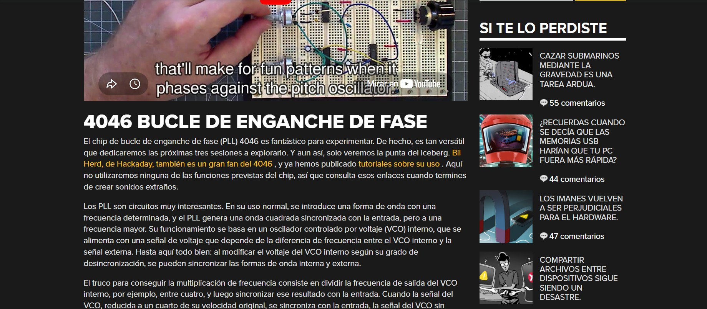
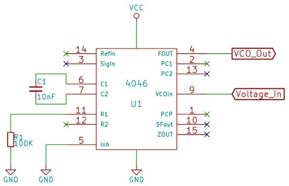

# sesion-10b

## clase 22 de mayo 

en la clase trabajamos en los grupos indicados para el proyecto dos. las clases anteriores decidimos que realizaríamos un oscilador, nos juntamos a definir todo lo que haríamos: búsqueda de chips, esquemáticos, y también buscamos en libros que había en el LID para guiarnos. como requisito se nos pidio tener dos modulos funcionales en una protoboard. 

> buacamos por hackaday algunos esquematicos y chips para probar y hacerle ciertas modificaciones 
