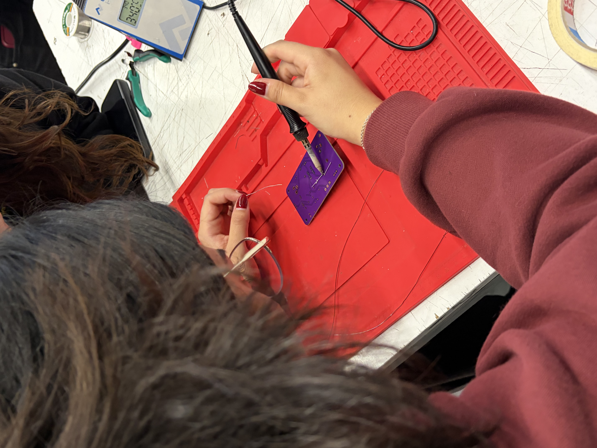
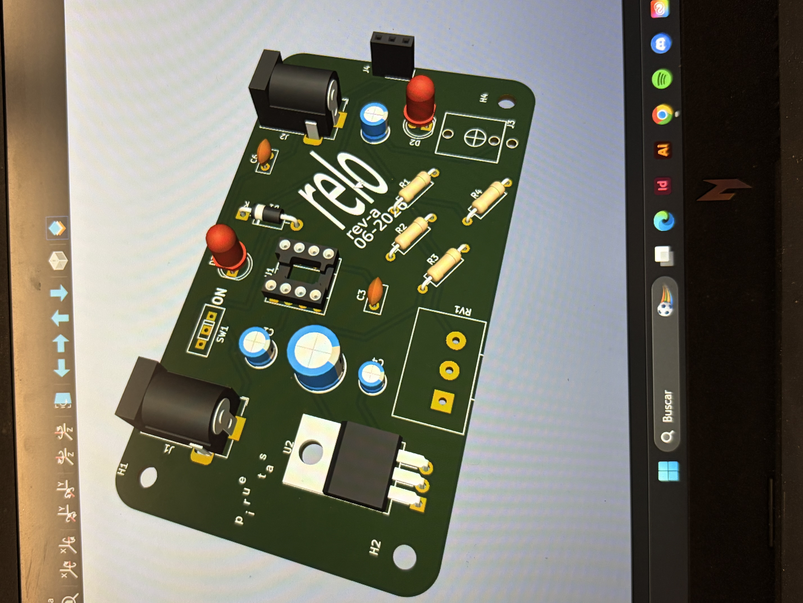
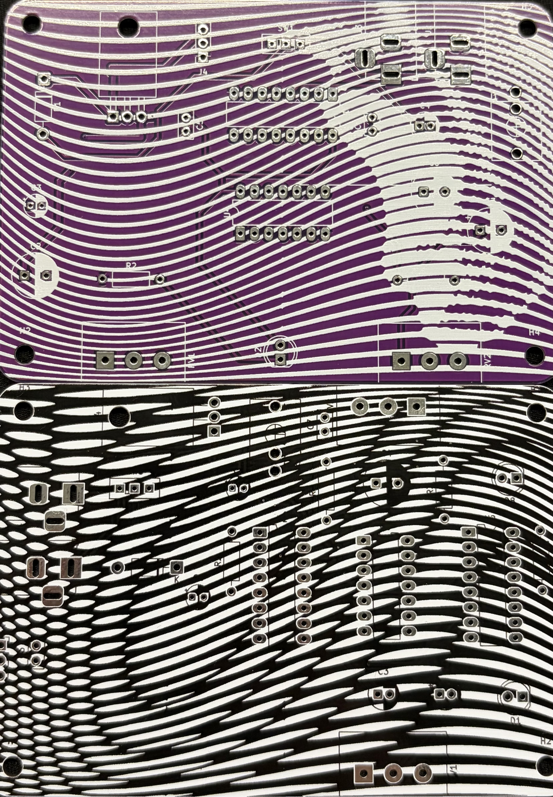
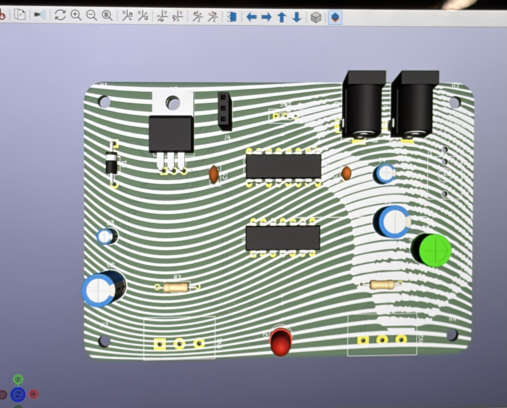
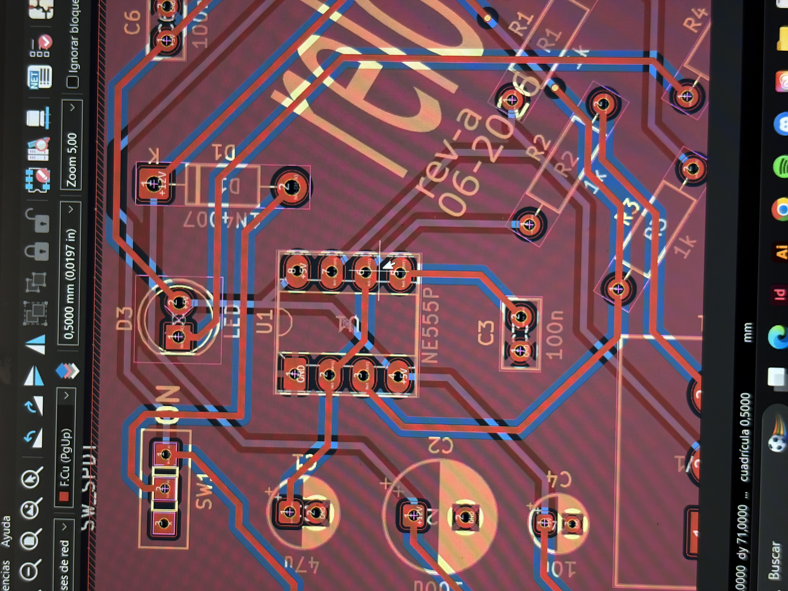
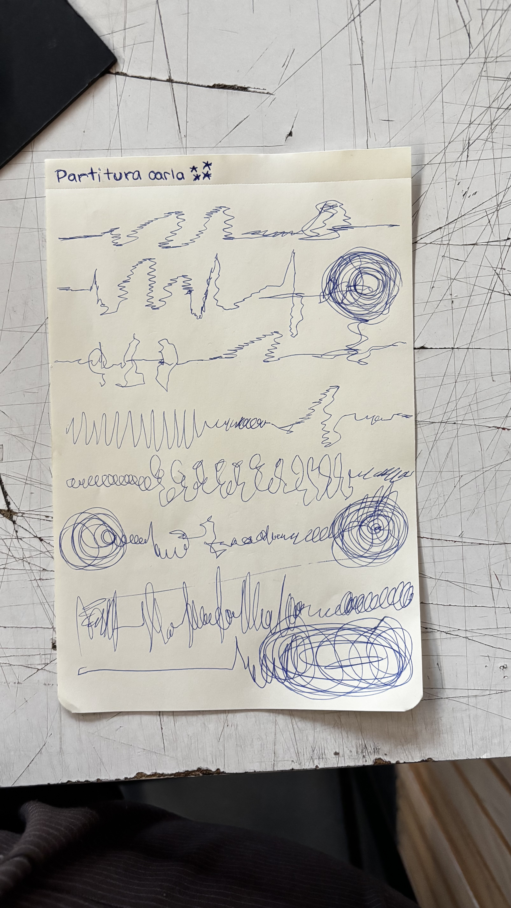

# sesion-14a

En la clase de hoy llegaron las placas y soldamos, se ven geniales! Me gustó mucho el resultado final de nuestras placas, sobre todo la de Comando Estelar. Nos dividimos las tareas, yo me encargué de hacer el listado de materiales mientras el resto del grupo soldaba

Algo que nos complicó un poco fue pensar en las partituras, gran parte de la clase estuvimos investigando y viendo referencias pero no entendíamos mucho, asi que escuchamos las grabaciones de ambos circuitos para inspirarnos y graficar en una hoja de papel cada sonido 

# orden para soldar

+ Base dip
+ Resistencias
+ Condensadores
+ C polarizados
+ Diodos
+ Transistores

(de lo más pequeño a lo más grande)

# CAPITULOS 5 y 6

De estos capitulos el que más impacto tuvo en mí fue SHI (De la cuna a la tumba del Sr. So) creo que aqui la idea del tiempo que se puede apreciar en capitulos anteriores se hace extremadamente evidente, donde se narra la vida entera de una persona en un solo parrafo. Esto me llevó a pensar mucho más en la sensación del paso del tiempo y la idea lo repentina que puede llegar a ser la muerte.

Esta pieza me recordó a la canción "Te Lo Prometo" del artista Humbe y la frase "Y el tiempo pasa rápido y lento ¿cómo vivo el momento?" me resonó con esta idea del tiempo y su fugacidad, la canción habla de la promesa y el intento de demostrar el amor que siente una persona con alzheimer a sus seres queridos. Aquí el tiempo representa la fragilidad de la vida y los recuerdos, más allá de ser un enemigo es una fuerza inevitable que nos arrastra sin advertencia y es en esta fragilidad del tiempo donde apreciar lo cotidiano se vuelve relevante. cosas tan simples como quemar un fosforo, tal como sugiere Ono en una de sus instrucciones, invitandonos a hacer una pausa en la rutina para contemplar el presente antes de que el tiempo se lo lleve.
