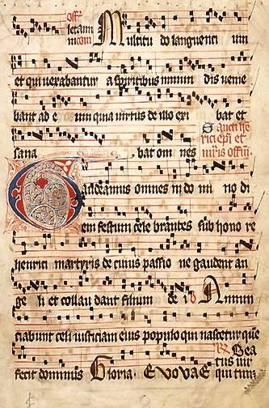
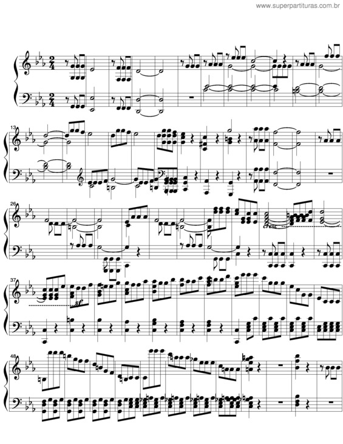
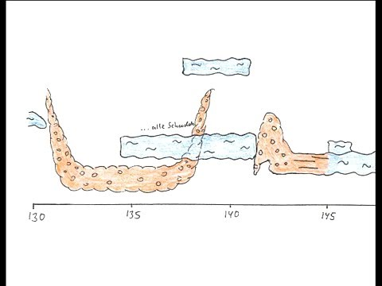
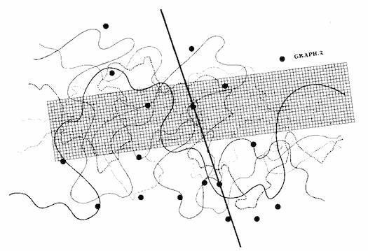

# sesion-13b
## Apuntes 12, Jun

En esta sesión nos metimos con todo en el tema de las partituras, viendo cómo pasaron de ser súper rígidas a convertirse en algo completamente libre y abstracto. Después de revisar varios referentes históricos bien locos, nos pusimos a trabajar en nuestras propias ideas basadas en la naturaleza.

### Historia y evolución de las partituras
* Orígenes y el canto gregoriano: Partimos hablando de las partituras y en mis apuntes anoté que las de los cantos gregorianos son las más antiguas de todas. Estaban escritas en un tetragrama medieval (de 4 líneas) y usaban neumas, que eran unas notas cuadradas. Lo loco es que no tenían las instrucciones tan claras ni compás o ritmo fijo; al final, la melodía se adaptaba por completo al texto en latín. Esto lo armó Guido d’Arezzo por el siglo XI para ordenar la música de la Iglesia.

  
+ De las sinfonías a la abstracción: Después pasamos a ver las sinfonías clásicas, que ya eran obras pesadas y complejas para orquestas completas, divididas en cuatro momentos bien marcados por tipos como Haydn, Mozart y Beethoven. Pero el verdadero quiebre vino cuando los signos se empezaron a volver más abstractos gracias a la semiótica en general, cambiando por completo la historia de lo que puede ser una partitura.

+ Stockhausen y la ciencia electrónica: Hablamos de Karlheinz Stockhausen y su obra *Gesang der Jünglinge*. Este tipo fue el pionero en publicar la primera partitura de música electrónica de la historia, demostrando que no era ruido al azar sino una ciencia exacta. Su partitura combinaba la voz humana y la fonética con puros gráficos de frecuencias electrónicas, metiendo por primera vez el control del espacio tridimensional (el sonido envolvente) directo en el papel.

+ John Cage y tirar todo al azar: También vimos a John Cage, que encontraba que los compositores tradicionales como Beethoven eran demasiado controladores. Para él, cualquier sonido del mundo podía ser música, desde el ruido del tráfico hasta el silencio de una sala. Su gran aporte fue meter el azar y la libertad absoluta en el arte, inventando las partituras indeterminadas donde el músico interpreta más allá de lo escrito.

### Avances en el Proyecto 03
Lluvia de ideas: Después de la introducción teórica, nos pusimos a trabajar en clases con los grupos para avanzar en el Proyecto 03. Con mi grupo nos pusimos a buscar diferentes ideas para inspirarnos en nuestras partituras, explorando cómo los elementos naturales se pueden transformar en signos musicales:
+ Plantas: El crecimiento orgánico nos sirve como ritmo y las hojas como notas.
+ Viento: Usar las direcciones y la intensidad del aire para marcar las dinámicas.
+ Agua: Tomar los flujos y las ondas como frases musicales.
Buscando referentes ambientales: En medio de la búsqueda revisamos temas minimalistas inspirados en el entorno como *Creek* de Hiroshi Yoshimura, *Serenade of Secrets* de Volodja Brodsky y el disco *Plantasia*.
  
El choque con el diseño industrial: Como grupo siento que nos costó un poco arrancar. Como la mayoría somos diseñadores industriales, al menos a mí me costó un montón soltarme y entrar en ese lado más artístico y libre que nos pedía el encargo, porque estamos demasiado acostumbrados a pensar en la funcionalidad técnica y las estructuras de las cosas.

---
### libro Pomelo de Yoko Ono

Capítulo 3 (Evento):
Este capítulo me gustó harto porque las instrucciones transforman gestos comunes o imposibles en eventos artísticos puros. Me llamó mucho la atención la *Pieza de nube* de la imagen, que propone andar cavando un hoyo en el jardín para poner las nubes cayendo gota a gota; es físicamente imposible, pero transforma un pensamiento intangible en una acción concreta. También rescato la *Pieza de reloj*, que me dio risa porque propone adelantar los relojes del mundo dos segundos en secreto y yo siempre adelanto los míos. El capítulo me atrapó por completo porque te saca de la realidad mezclando lo cotidiano con lo ilógico, como lo de caminar siguiendo un mapa inventado o tirar una piedra tan alto que nunca regrese.

Capítulo 4 (Poesía):
Aquí Yoko Ono se va por el lado de las piezas con fines abiertos donde cada quien encuentra su propio sentido libremente. La *Pieza de líneas* de la imagen me pareció súper interesante porque te muestra puras líneas dibujadas donde dice "esta línea es una parte de una línea más larga...", algo imposible de verificar que puede terminar significando lo que uno quiera. Me descolocó un poco el poema para leer con lupa porque te frena en seco y te hace ver que la poesía va más allá de las palabras, invitándote a mirar lo invisible. Aunque dinámicas como el "verdadero y falso" me hicieron perder el hilo, rescato ideas visualmente brutales de su lista de compras como la *Máquina de desaparición* o la *Casa de luz*.
