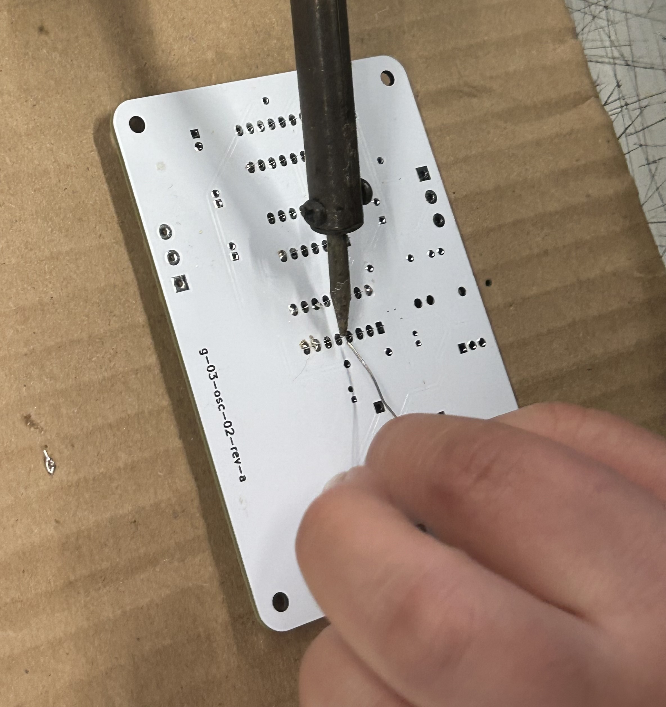
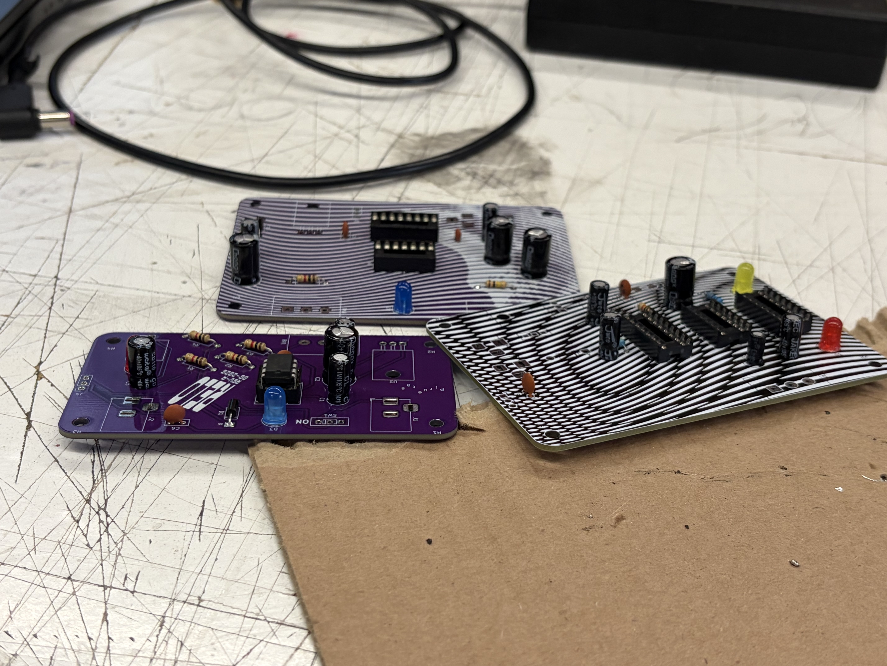
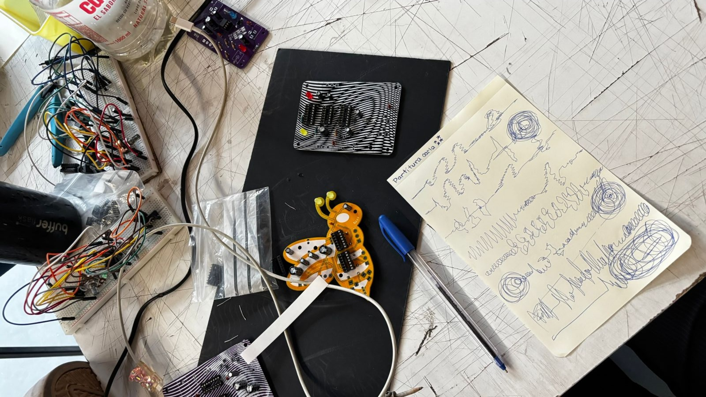

# sesion-14a
## Clase 16, Jun

En esta clase nos enfocamos a soldar porque por fin llegaron las placas de los chinitos y los profes trajeron todos los implementos. Al principio no sabía bien cómo soldar, pero mis compañeros me explicaron, le agarré confianza y pude armar varios componentes mientras nos dividíamos el trabajo en grupo. 

### El trabajo en clases y soldar en la PCB
Durante las horas de taller nos pusimos manos a la obra con las placas reales y aprendimos cómo soldar.
* La técnica correcta: Para soldar bien, se junta la punta del cautín caliente tocando al mismo tiempo la patita del componente y el círculo de cobre de la placa (el pad) por unos dos segundos. Ahí recién acercas el hilo de estaño para que se derrita con el calor de las piezas y no directamente con la punta del cautín, logrando que el metal fluya bien y forme como un volcán o cono brillante.
* Cuidado con derretir todo: No hay que dejar el cautín pegado más de tres segundos porque el exceso de calor puede quemar el chip por dentro o terminar despegando las pistas de cobre de la placa.

### Organización del grupo dentro del taller
Para avanzar rápido en el aula y no dejar la escoba, nos dividimos las tareas de manera súper estratégica.
* Cadena de producción: Nos separamos los roles para que mientras unos estábamos concentrados usando el cautín, otros estuvieran chequeando la lista de materiales y los precios de todo.
* El control de calidad: Un punto clave fue tener a alguien revisando los planos para confirmar la posición y orientación exacta de cada resistencia o zócalo antes de tirar el estaño, asegurándonos de que el circuito no fallara al final.

### Trabajo fuera de clases 
Como queríamos dejar todo listo, decidimos quedarnos despues de clases para ganarle al tiempo.
* Terminar los pendientes: Nos quedamos un buen rato extra con el grupo para terminar de soldar hasta el último componente que nos quedaba suelto en las placas.
* El momento del estanque: Justo después de terminar la parte técnica nos pusimos a ver el diseño de las partituras, pero nos costó un montón y nos quedamos todos pegados en blanco, sin ninguna idea para avanzar.

### Las ideas creativas que tuvimos caminando
Para salir del bloqueo mental, implementamos la técnica de salir a caminar sin rumbo y tirar ideas totalmente random para conectar con el proyecto.
* Traducir el sonido a dibujos: Nos pusimos a escuchar los osciladores y notamos que el audio era suave y fluido, como una curva, aunque medio distorsionado. Por eso decidimos plasmar las partituras de forma visual usando líneas curvas y espirales circulares en vez de trazos rectos o estructuras rígidas.
* El concepto de la carcasa tipo cuadro: Para el diseño del contenedor nos encantó la idea de hacer una cápsula totalmente transparente para que se note todo el cablerío y las placas por dentro, pero dejando los potenciómetros y las perillas distribuidos de forma artística por fuera en diferentes lugares, pareciendo casi un cuadro interactivo.

Aqui dejo imagenes del avance del trabajo

---

### Libro Pomelo de Yoko Ono
**Capítulo 5: (Object)**
Este capítulo es súper interesante porque cambia por completo lo que entendemos por arte físico al invitarnos a coleccionar de una manera conceptual y mental. Lo que más me llamó la atención fue la "Pieza de colección I", que propone romper todas las tazas de la casa y luego juntar los pedazos en un bolso para guardarlos con el tiempo. Me gustó caleta porque nos enseña a ver la belleza en lo roto y a darle valor afectivo a las cosas cotidianas a través de los recuerdos y el paso de los años. Al final, Yoko Ono nos demuestra que una colección no tiene que ser perfecta ni costosa, sino que puede nacer de un acto destructivo y poético que transforma objetos comunes en verdaderas obras de arte íntimas.

**Capítulo 6: (Film)**
Este capítulo me pareció súper volado y rupturista porque propone una forma de hacer cine totalmente interactiva, donde la pantalla deja de ser un espacio pasivo. Me dio mucha risa y curiosidad el fragmento de "Cuestionario para un film N° 4", donde le pregunta al público si siente culpa por ver traseros en la pantalla y si preferiría ver traseros de celebridades. Me gustó mucho porque cuestiona la censura y la moral de la sociedad con un humor bien irónico y directo, incomodando de forma divertida a los espectadores. Con estas instrucciones absurdas, se nota que ella busca transformar al público en el verdadero protagonista de la película, haciendo que sus reacciones y pensamientos completen la experiencia artística de la obra.
