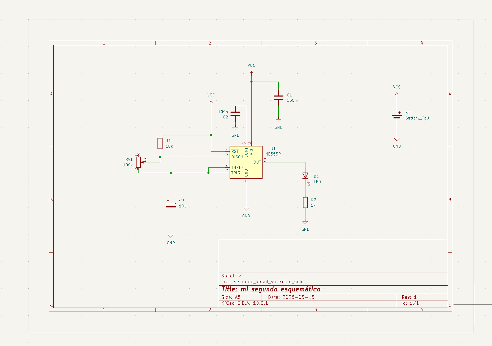
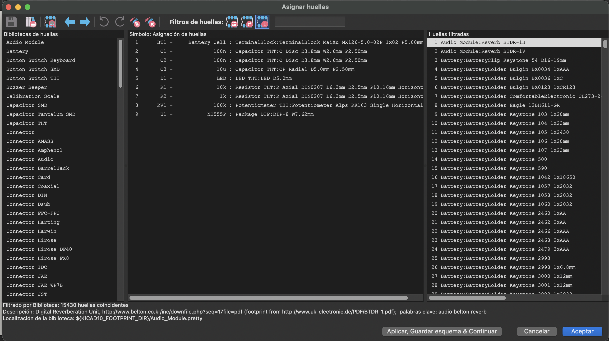
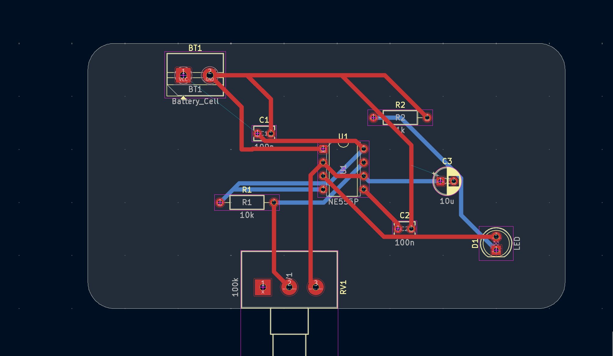
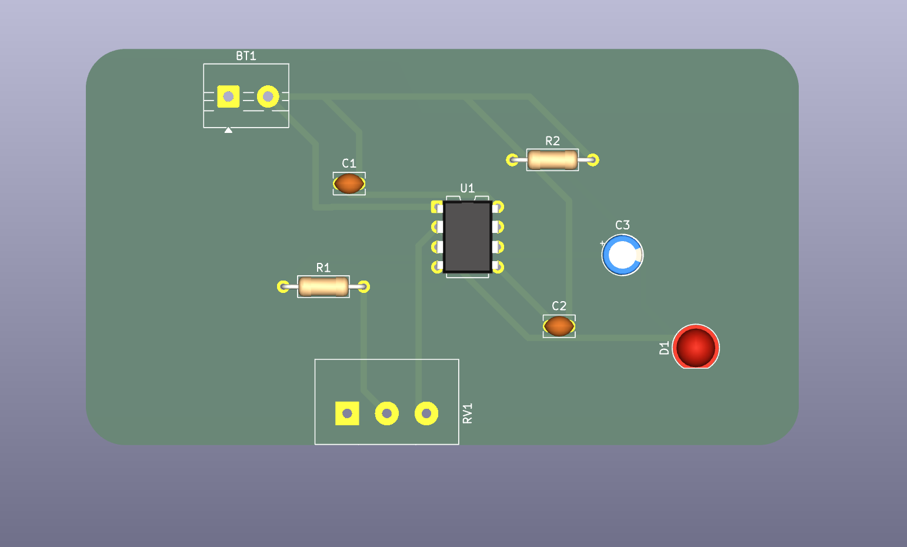

# sesion-09a

Apuntes de clase online — Diseño PCB en KiCad

Recordatorios:

+ Alt + 3: abrir visor 3D.
+ La capa Edge.Cuts: contorno de la PCB.
+ Se utilizarán 7 capas:
+ 1 capa de contorno: Edge.Cuts
+ 2 capas de cobre: F.Cu (frontal) y B.Cu (trasera)
+ 2 capas de silkscreen
+ 2 capas de mask
+ La parte frontal de la PCB se enfoca más en la estética, mientras que la parte trasera se relaciona más con el funcionamiento.
+ Click derecho → alinear.
+ El terminal block se utiliza para conectar la batería a la PCB.

+ Terminal block:   es un componente modular con un marco aislado que une de forma segura y ordenada dos o más cables eléctricos. Se utilizan para fijar, conectar y distribuir conductores en tableros eléctricos y dispositivos industriales. 

## Contorno PCB

La clase comenzó con la creación del contorno de la PCB. Esto se realiza en la capa Edge.Cuts, utilizando la herramienta de rectángulo. Luego, se hace doble click sobre el rectángulo para ajustar sus dimensiones y redondear las esquinas.
El siguiente paso fue acomodar los componentes dentro del contorno creado. La idea de esta etapa es ordenar los componentes de manera estética y funcional, por lo que se recomienda ir revisando constantemente el visor 3D para observar cómo se verá la PCB físicamente.

## Pistas 

Después comenzamos a trabajar con las pistas, que son líneas de cobre dentro de la PCB y funcionan como “cables planos”. Estas se trabajan principalmente en la capa F.Cu, que corresponde a la parte frontal, mientras que B.Cu corresponde a la parte trasera de la PCB.

Se recomienda trabajar con dos medidas de pistas:

- 0.4 mm
- 0.8 mm

Para enrutar pistas se utiliza la herramienta de trazado de pistas, donde también se puede configurar el grosor.
Primero aprendimos a realizar las conexiones positivas utilizando pistas de 0.8 mm. Luego, usamos pistas de 0.4 mm para las conexiones entre componentes.
Cuando las conexiones se cruzan, las pistas no pueden pasar una encima de otra en la misma capa. Para solucionar esto, se puede cambiar a la capa trasera de la PCB o también utilizando una vía.

Una vía es una conexión que une la capa frontal (F.Cu) con la capa trasera (B.Cu). Mientras se está trazando una pista, si esta se cruza con otra, se puede crear una vía para continuar el recorrido por la parte trasera y así evitar cruces. Con la tecla V se puede cambiar entre la capa frontal y la trasera durante el trazado.
Si hacemos click en una vía, también es posible modificar su tamaño. 

## Flusser, capítulo 1 

Vilém Flusser fue un filósofo y escritor checo-brasileño que trabajó temas relacionados con la comunicación, las imágenes y la tecnología. En sus textos reflexiona sobre cómo los medios técnicos cambian nuestra manera de pensar y de relacionarnos con la realidad.

En este capítulo se habla de cómo las imágenes, la escritura y la tecnología cambian la forma en que entendemos el mundo. Vilém Flusser parte hablando de la fotografía, pero en realidad se refiere a algo mucho más grande, que es cómo los medios técnicos como las cámaras, el cine, el video o las computadoras terminan influyendo en nuestra forma de pensar y también de vivir.

Habla de las “imágenes técnicas”, que serían imágenes hechas mediante aparatos tecnológicos y no solamente por la mano humana, como pasa con una pintura o un dibujo. Entonces la cámara no sería algo totalmente neutral, porque igual condiciona lo que podemos hacer y cómo vemos las cosas.

Flusser diferencia dos formas de pensamiento:

+ el pensamiento mágico: relacionado con las imágenes
+ el pensamiento histórico o lineal: relacionado con la escritura

Me deja pensando esto, porque hoy estamos rodeados de imágenes y tecnologías que influyen mucho en cómo mostramos nuestra vida y en cómo vemos la realidad. Pero igual me surge una duda, porque la fotografía para mí es importante y tiene un valor más personal, ya que me ayuda a guardar recuerdos y a mantener parte de mi historia. Siento que ahí la imagen no reemplaza la realidad, sino que la acompaña. Aunque ahora, con las redes sociales, a veces esas imágenes también se usan más para mostrar o “publicar” la vida que para recordarla realmente y me hace preguntarme si la fotografía realmente captura el momento tal como es, o si termina mostrando más lo que queremos aparentar. 

## Encargo esquemáticos y PCB en KiCad

**1. Construcción del esquemático**
   
Comencé realizando el esquemático del circuito “4 steps” basado en el temporizador 555.
Durante el proceso, el principal inconveniente fue que el orden de las patitas del chip 555 no coincidía con el esquemático de referencia que estaba utilizando. Esto me confundió al momento de conectar los componentes.

Como no sabía aún cómo modificar el orden de las patitas en KiCad, y considerando que los profesores explicarían ese tema más adelante, decidí utilizar el orden estándar entregado por KiCad.

Para resolver la conexión de manera correcta, apliqué la lógica vista en clases, priorizando la funcionalidad del circuito, especialmente manteniendo la conexión de GND cercana a la patita correspondiente (pin 5) aunque su posición visual estuviera arriba en el esquema.
El esquemático del 555 lo completé sin errores. 

 

**2. Asignación de huellas**
   
En este paso no pude recordar la ubicación de ciertas cosas en la parte de biblioteca de huellas, por lo que revisé los videos de la clase para guiarme. 

 

**3. De huellas  a PCB**

Después de asignar las huellas, seguí con el proceso de pasar el esquemático a PCB, el cual me tomó más tiempo porque  lo vimos en la clase del martes.

Primero trabajé en el contorno de la placa en la capa Edge Cuts, definiendo la forma del PCB. Luego comencé a ubicar los componentes dentro del contorno, intenté  organizarlos según la cercanía de las conexiones entre ellos para facilitar las conexiones después.

Como el circuito no tenía demasiados componentes, los acomodé de forma ordenada, pero más que nada priorizando la lógica de la conexiones.

**4. Pistas**

Primero conecté las líneas de alimentación (positivos), y luego las conexiones entre los distintos componentes.

En este proceso tuve algunos problemas, porque olvidé ajustar el tamaño de las pistas al inicio. Cuando me di cuenta, ya había avanzado bastante y no supe cómo cambiarlo en ese punto del trabajo.

También tuve una duda importante: cuando una pista no podía continuar en la misma capa debido a los cruces, los cambiaba a la capa trasera del PCB. En algunos casos continué algunas pistas en esa capa, pero no estaba segura si estaba correcta.

Entre en un momento llena de dudas con  el uso de vías, ya que no entendí completamente cuándo es mejor:

+ usar una pista en la parte frontal 
+ cambiar a la parte trasera
+ o utilizar una vía para conectar ambas

 

**DUDAS:** 

+ ¿Cuál es la diferencia exacta entre usar una pista en otra cara y usar una vía?
+ ¿Cuándo se debe cambiar de cara y cuándo es obligatorio usar una vía?
+ ¿Cómo se puede cambiar el tamaño de las pistas después de haber comenzado, sin tener que rehacer todo?
+ ¿Cómo cambiar o reorganizar el orden de las patitas del 555 en KiCad?

**Resultado final: no agregue la conexión del negativo porque no estaba segura cómo hacerlo**

 

De los dos módulos, decidí trabajar solo con uno para enfocarme en comprender mejor en el 555, ya que es más sencillo y me permitía avanzar de forma más clara sin confundirme con demasiada información al mismo tiempo. Aun así, el circuito con el 555 me quedó incompleto por las dudas que surgieron durante el proceso.

