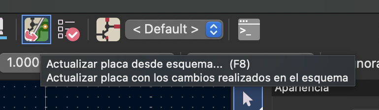

# sesion-09b

### Flusser, cap. 2, 3

En el capítulo 2 y 3, Vilém Flusser explica cómo las imágenes técnicas y los aparatos influyen en la forma en que entendemos el mundo. 

Las imágenes técnicas, como la fotografía, son imágenes creadas por aparatos tecnológicos. No son neutrales, porque vienen de procesos científicos y de programas. Aunque parecen una ventana a la realidad, en verdad son construcciones, porque no vemos todo lo que ocurre dentro de él, lo que Flusser llama la “caja negra”. Confiamos en ellas sin cuestionarlas mucho, como si mostraran el mundo como es. 

En el capítulo 3, profundiza en la idea de los aparatos. Dice que no son solo herramientas, sino sistemas programados que permiten ciertas posibilidades y limitan otras. En este sentido, el fotógrafo juega con el aparato, explorando lo que la cámara le permite hacer. Lo llama “funcionario del aparato”, porque actúa dentro de un sistema ya programado.

Me cuestiono por qué la fotografía no muestra la realidad tal como la vemos con nuestros ojos, si en teoría está capturando algo que sí existe en ese momento. Me pregunto por qué no sería lo mismo, si al sacar una foto se supone que estamos viendo lo mismo que está frente a la cámara. Entonces también me surge la duda de si al pasar por la cámara y por esta “caja negra” ya deja de ser lo mismo, aunque igual siga siendo algo de la vida real. No termino de entender si el cambio está en la imagen misma o en la forma en que el aparato procesa lo que tiene enfrente.

## Apuntes – Ajuste de huellas (PCB)

+ Para ajustar la huella de un componente, se puede hacer clic en cada uno y modificar su huella de forma individual, Para que estos cambios se mantengan en la placa, es necesario actualizar la PCB.
+ Al actualizar la placa, se sincronizan y se actualizan todas las huellas. 

    
  
  
### Cómo cambiar las patitas del 555 en el esquemático

+ Existen símbolos que vienen desde las bibliotecas de KiCad, no se deben editar los símbolos originales de la biblioteca, sino que se debe hacer una copia (tipo fork).
  
Para esto:

1.- Ir a Preferencias - bibliotecas de símbolos

2.- Crear una nueva biblioteca (.kicad_sym) donde se guardarán los símbolos editados

  
  
Luego:

3.- Buscar el símbolo del 555 en otra biblioteca

4.-  Copiarlo

5.-  Pegar y guardarlo en la biblioteca propia
  
 En el símbolo editado: Se pueden modificar los pines desde Propiedades del pin.
  
También se pueden mover:

1.-  Seleccionar el pin

2.-  Presionar M (mover)

3.-  Mover el pin 5 de arriba hacia abajo

4.-  En el editor de símbolos también se puede editar gráficamente:

5.-  Presionar E para editar propiedades (color, relleno, etc.)
  
+ Si aparece un asterisco (*), significa que el archivo no está guardado
  

### Botones e interruptores

Existen dos tipos principales:

+ Temporales (push button): funcionan solo mientras se presionan
+ Switch (interruptor): cambia de estado y se mantiene
  
Ejemplo:

+ Push button:  como un timbre
+ Switch:  como prender/apagar una luz

