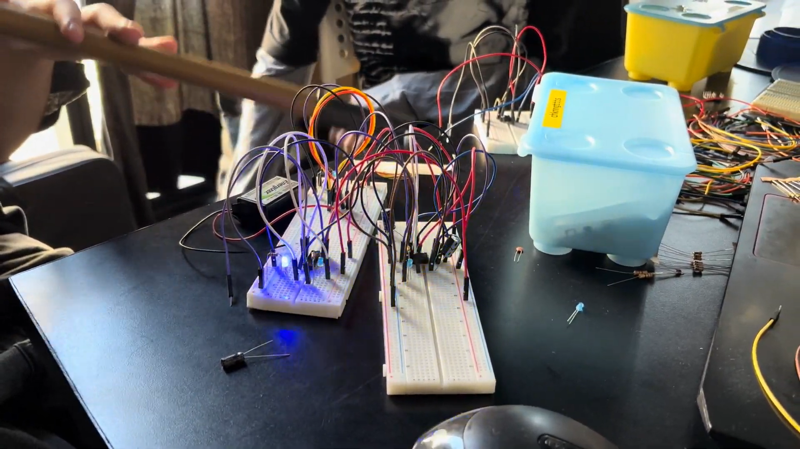
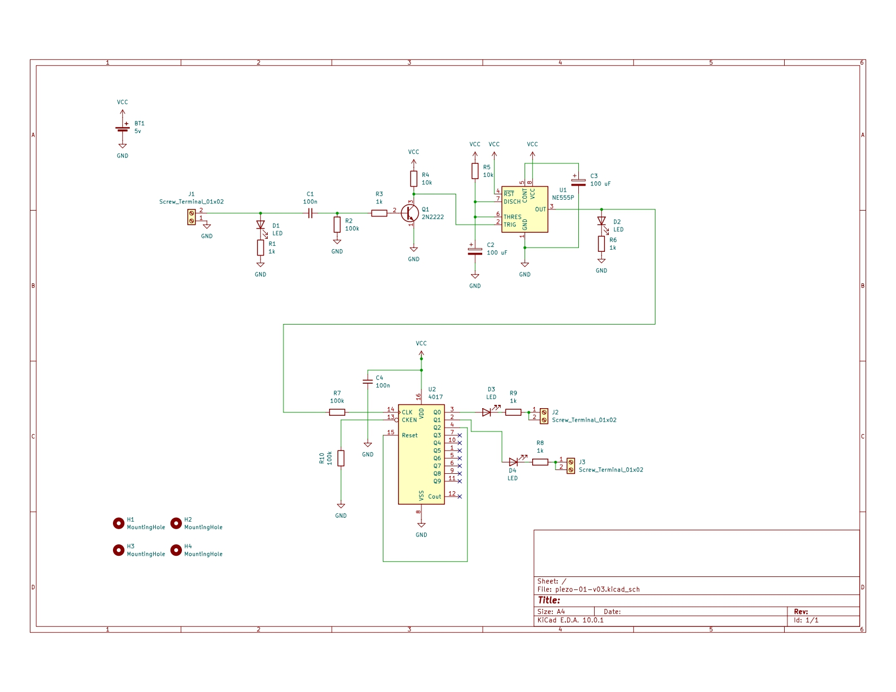

# sesion-11a

# Apuntes 26/05

Durante clases nos seguimos dedicando a trabajar en el proyecto 02, por lo que nos dedicamos a resolver el circuito de la opción 01, ya que trabajamos en este el lunes 25 durante la mañana y logramos que funcionara, pero por alguna razón llegaba a un punto en el que dejaba de prender los LEDs y esto se solucionaba desconectando el cable que estaba en el ``reset`` del 4017, dejarlo interactuar con el aire por unos segundos y volver a conectarlo en donde debía ir XD no entendimos por qué sucedía esto y preferimos guardar las preguntas para la clase de hoy.

Antes de explicar la situación, Misa nos revisó el circuito y nos hizo las siguientes correcciones:

+ Añadir un capacitor de 100μF en el pin 5 del chip 555
+ Arreglar la conexión entre el chip 555 y 4017, ya que estabamos utlizando el pin 3 del 555 como salida y el pin 13 del 4017 como entrada, siendo que tenemos que utlizar el pin 14 del 4017 en vez del 13.
+ Unir el pin 13 del 4017 a tierra mediante una resistencia de 100k

Luego de hacer estos cambios, el esquemático quedó de la siguiente manera:

