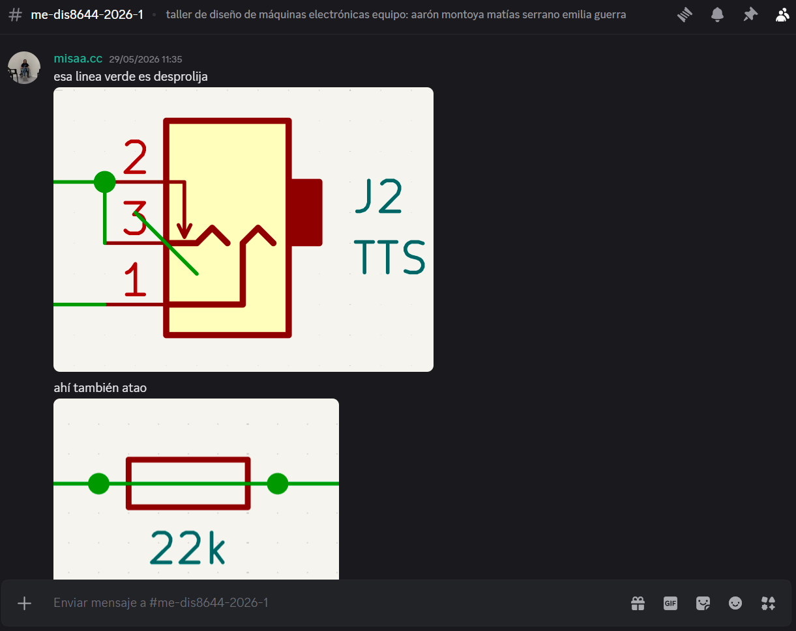
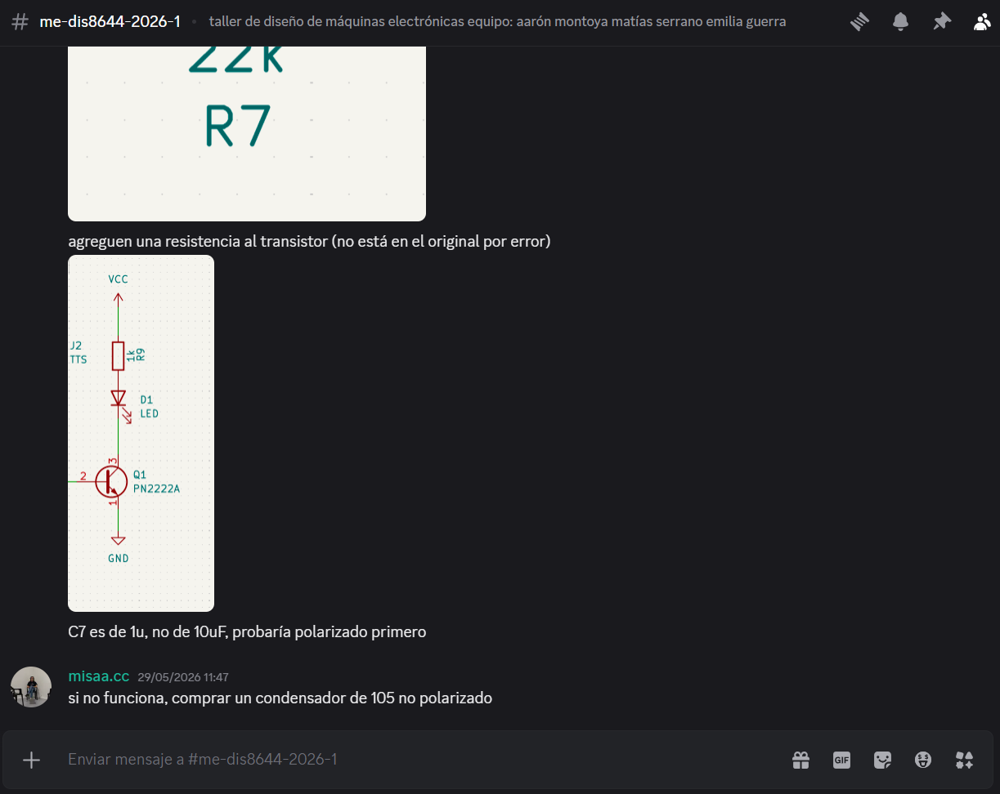

# sesion-11b

# Apuntes 29/05

Cuando llegué a la sala Aarón me contó que estábamos limpiando la sala ya que desde inicios de semestre hay residuos de materiales de los cuales nadie se ha hecho cargo, pero como llegué un poco justo a la hora de inicio de clases solo alcancé a dejar en el reciclaje unos cartones por lo que no hice mucho aporte, pero me alegró ver que todos estaban ayudando!!

Una vez ya partimos la clase, nos dedicamos a seguir revisando el circuito de la alternativa 02 (el que la clase pasada no funcionó), pero como no lográbamos entender cuál era el problema le tuvimos que pedir ayuda a Misa. Cuando Misa nos revisó el esquemático, se dio cuenta de que habían cosas extrañas, por lo que pidió que le enviemos el archivo de KiCad por discord y nos respondió lo siguiente:

